# Praktikum Sistem Operasi – Pertemuan 2  
### Pengenalan Sistem Operasi & Instalasi Ubuntu Server

> Nama   : Muhammad Fauzi Fadillah
>
> NIM    : 254107020085
>
> Kelas  : TI_1G

---

# 1.1 Deteksi Perangkat Keras di Linux

# Praktikum 2.1 — Identifikasi CPU dan Memori
## Tujuan: memahami spesifikasi CPU dan kondisi memori pada server/VM.

## **Langkah-langkah**:


## 1. Tampilkan informasi CPU:

```bash
lscpu
```

- 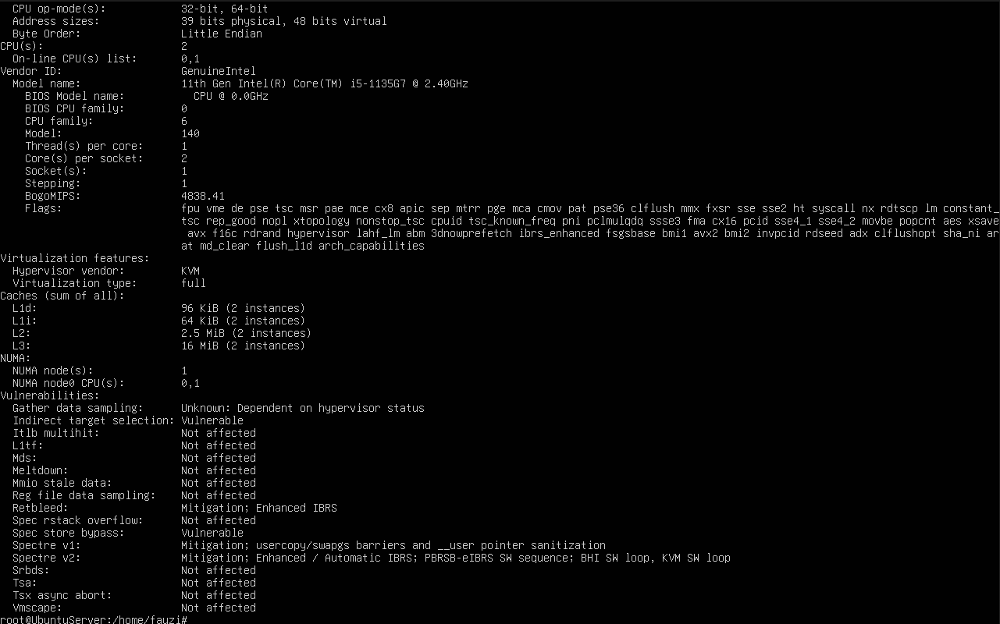


## 2. Tampilkan ringkasan memori:

```bash
free -h
```

- 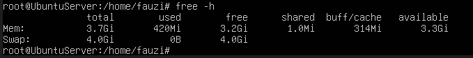


## 3. Cek informasi hardware dari DMI/BIOS (butuh sudo):

```bash
sudo dmidecode -t system
```

- 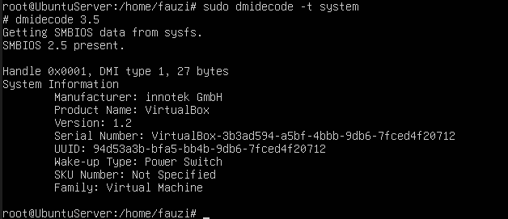


## Latihan 2.1
### Catat: (1) jumlah CPU(s), core/thread, (2) total RAM, (3) total swap. Jelaskan perbedaan RAM vs swap dalam 2–3 kalimat.

- Core      : 2
- Threads   : 1
- RAM       : 4 GB
- Swap      : 4 GB

Perbedaan RAM dan swap, RAM adalah memori utama berkecepatan tinggi yang menyimpan data aktif secara sementara (volatile) saat komputer menyala, sedangkan swap adalah ruang cadangan pada penyimpanan (HDD/SSD) yang digunakan sebagai virtual memory saat RAM fisik penuh


---

# Praktikum 2.2 —  Identifikasi Perangkat PCI/USB dan Driver
## Tujuan: mengenali perangkat PCI/USB dan melihat driver/modul yang dipakai

## **Langkah-langkah**:


## 1. Lihat daftar perangkat PCI:

```bash
lspci
```

- 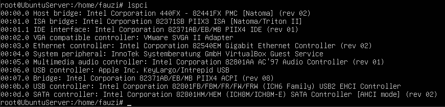


## 2. Lihat perangkat PCI beserta driver kernel yang digunakan:

```bash
lspci -nnk
```

- 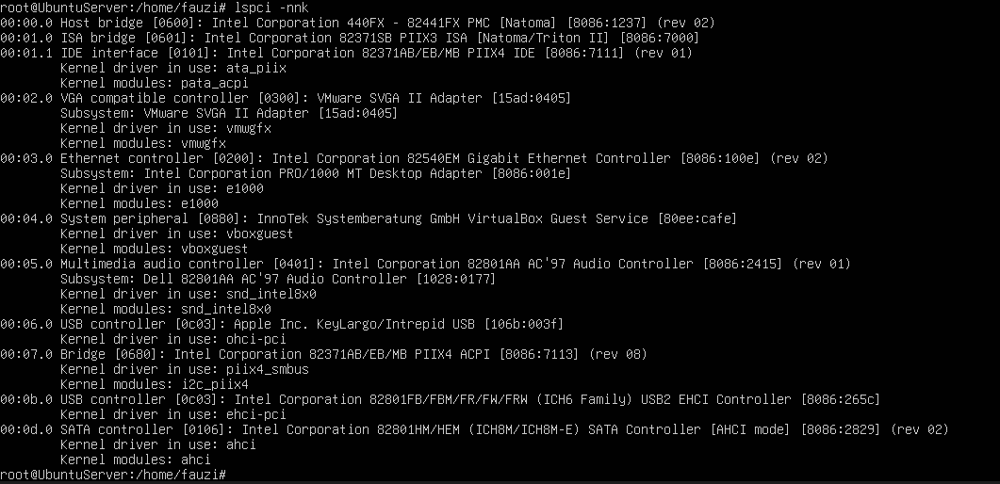


## 3. Fokus pada NIC (Ethernet) untuk mencari modul driver:

```bash
lspci -nnk | grep -A3 -i ethernet
```

- 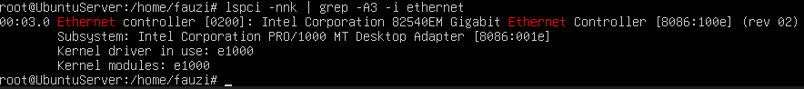


## 4. Lihat perangkat USB:

```bash
lsusb
```

- 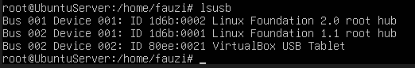


## 5. Lihat topologi USB (tree):

```bash
lsusb -t
```

- 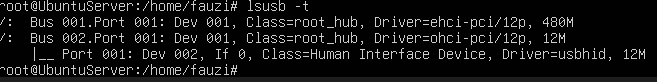


## Latihan 2.2
### Temukan 1 perangkat PCI (misal NIC) dan tuliskan: Vendor:Device ID (angka heksadesimal), nama driver/modul kernel, dan deskripsi singkat fungsinya.

- Device ID : 8086 (Intel Corporation)
- Vendor ID : 2829 (ICH8M SATA Controller)
- Nama Driver : ahci

Deskripsi:  
Perangkat ini adalah SATA Controller dalam mode AHCI.

Fungsinya:

- Mengontrol komunikasi antara motherboard dan perangkat penyimpanan SATA (HDD/SSD)
- Mengatur transfer data antara storage dan CPU
- Mendukung fitur seperti:
  - Hot swapping
  - Native Command Queuing (NCQ)
  - Manajemen performa disk

Tanpa controller ini, sistem operasi tidak dapat mengakses hard disk atau SSD berbasis SATA.


---

# Praktikum 2.3 —  Identifikasi Storage dan Filesystem
## Tujuan: memahami disk/partisi dan filesystem yang terpasang

## **Langkah-langkah**:


## 1. Lihat daftar disk/partisi:

```bash
lsblk -f
```

- 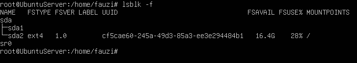


## 2. Tampilkan UUID dan tipe filesystem:

```bash
sudo blkid
```

- 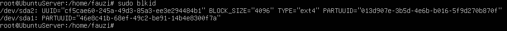


## 3. Lihat mount point untuk root filesystem:

```bash
findmnt /
```

- 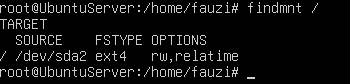


---

# 1.2 Modul Kernel dan Driver Perangkat

## Lokasi modul kernel

```bash
/lib/modules/$(uname -r)/
```

- 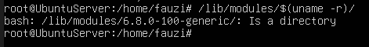

# Praktikum 2.4 —   Melihat Modul Aktif dan Informasinya
## Tujuan: mengenal modul aktif dan keterkaitannya dengan perangkat.

## **Langkah-langkah**:


## 1. Cek versi kernel:

```bash
uname -r
```

- 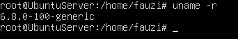


## 2. Tampilkan daftar modul aktif:

```bash
lsmod | head
```

- 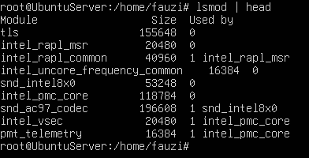


## 3. Pilih salah satu modul (contoh aman: loop) dan lihat detailnya:

```bash
modinfo loop
```

- 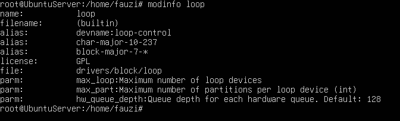


## 4. Muat modul (jika belum aktif), lalu verifikasi:

```bash
sudo modprobe loop
lsmod | grep -i loop
```

- 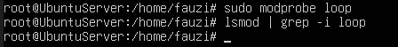


## 5. (Opsional) lihat pesan kernel terbaru:

```bash
dmesg -T | tail -n 20
```

- 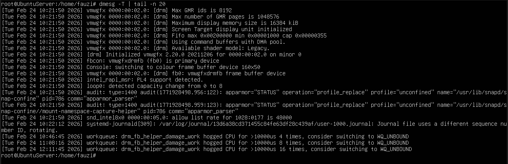


# Praktikum 2.5 — Konfigurasi Auto-load dan Blacklist
## Tujuan: memahami cara membuat modul otomatis dimuat atau diblokir.

## **Langkah-langkah**:


## 1. Buat file auto-load:

```bash
echo " loop " | sudo tee / etc / modules - load . d / loop . conf
```

- 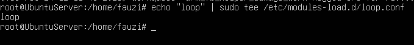


## 2. Simulasikan verifikasi (tanpa reboot) dengan memastikan modul sudah aktif:

```bash
lsmod | grep -i loop
```

- 


---


# Praktikum 2.6 — Mengenali Block vs Character Device
## Tujuan: membedakan perangkat disk vs terminal

## **Langkah-langkah**:


## 1. Lihat detail salah satu disk (sesuaikan dengan perangkat Anda, misal sda)

```bash
ls -l /dev/sda
```

- 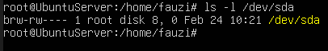


## 2. Lihat detail device terminal:

```bash
ls -l /dev/tty
```

- 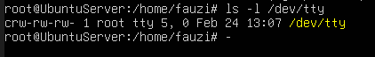


## 3. Lihat disk dan partisi untuk mengaitkan dengan /dev:

```bash
lsblk
```

- 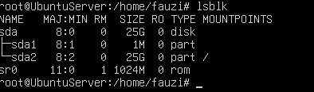


## Latihan 2.3
### Dari output ls -l, jelaskan perbedaan penanda file untuk block device dan character device. (Hint: karakter pertama pada permission string)

- Block Device (b): Direpresentasikan sebagai array of blocks. Sistem operasi dapat membaca/menulis blok tertentu tanpa harus melewati blok sebelumnya. Contoh: hard disk, SSD, USB drive.
- Character Device (c): Direpresentasikan sebagai aliran data kontinu. Data dibaca secara berurutan, tidak bisa seek/lompat. Contoh: keyboard, mouse, serial port, terminal.


---


# Praktikum 2.7 — Melihat Informasi udev
## Tujuan: melihat metadata yang dipakai udev untuk membuat device node.

## **Langkah-langkah**:


## 1. Cek atribut udev untuk disk:

```bash
udevadm info -- query=all --name=/dev/sda | head -n 30
```

- 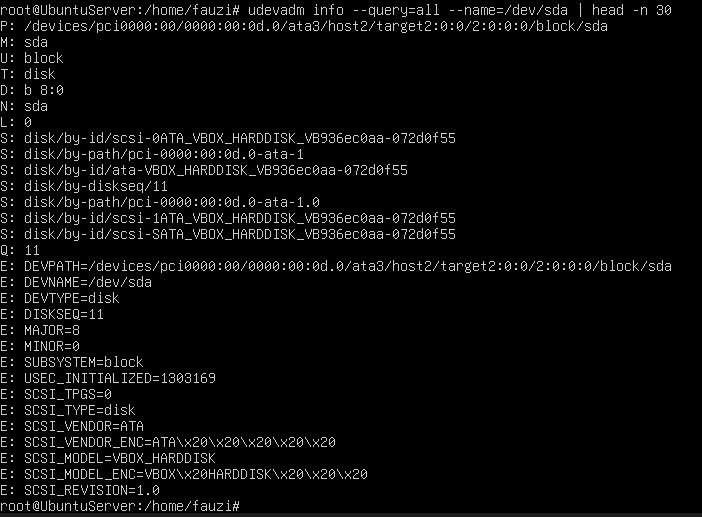


## 2. (Opsional) monitor event udev (jalankan, lalu colok/lepas USB pada mesin fisik):

```bash
sudo udevadm monitor
```

- 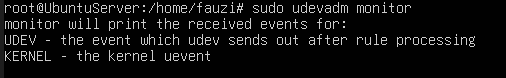


---


# Praktikum 2.8 — Membuat Workspace Praktikum
## Tujuan: membuat area kerja aman untuk semua latihan bab ini.

## **Langkah-langkah**:


## 1. Buat direktori praktikum dan masuk ke dalamnya:

```bash
mkdir -p ~/ praktikum - os / week02
cd ~/ praktikum - os / week02
pwd
```

- 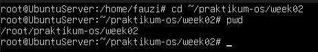


## 2. Buat beberapa file contoh:

```bash
touch notes . txt data . log config . txt
ls - lah
```

- 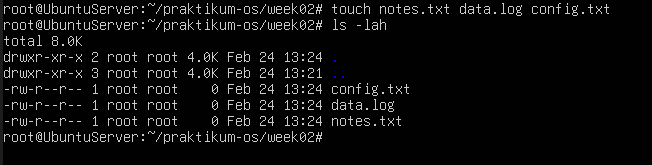


## 3. Isi file log contoh (simulasi):

```bash
echo " INFO : service started " >> data . log
echo " WARN : disk usage high " >> data . log
echo " ERROR : failed to connect " >> data . log
cat data .log
```

- 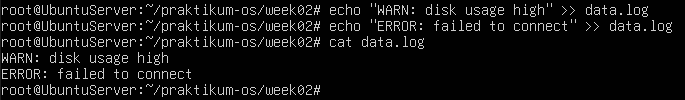


## 4. Baca file dengan less

```bash
less data .log
```


---


# Praktikum 2.9 — Pencarian Pola dengan grep

## **Langkah-langkah**:


## 1. Cari baris yang mengandung ERROR pada data.log:

```bash
grep " ERROR" data.log
```

- 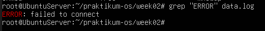


## 2. Cari tanpa memperhatikan huruf besar/kecil:

```bash
grep -i " error" data.log
```

- 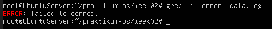


## 3. Tampilkan nomor baris:

```bash
grep -n "WARN" data.log
```

- 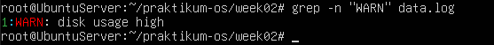


## 4. Tampilkan baris yang tidak cocok (invert match):

```bash
grep -v "INFO" data.log
```

- 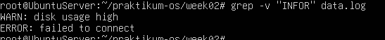


## Latihan 2.4
### Gunakan grep untuk menampilkan hanya baris yang mengandung INFO atau WARN dari data.log. (Hint: gunakan grep -E dengan pola alternatif)

```bash
grep -E "INFO|WARN" data.log
```

- 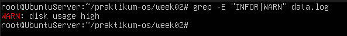


---


# Praktikum 2.10 — Substitusi dengan sed (Aman di File Latihan)

## **Langkah-langkah**:


## 1. Siapkan file konfigurasi latihan:

```bash
cat > config.txt << ’EOF’
PORT=8080
MODE=dev
SERVICE_NAME = myserver
EOF
cat config . txt
```

- 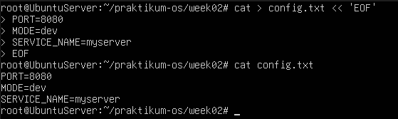


## 2. Ganti dev menjadi prod (tanpa mengubah file asli):

```bash
sed ’s/MODE=dev/MODE=prod/’ config.txt
```

- 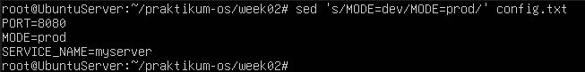


## 3. Terapkan perubahan langsung ke file (-i):

```bash
sed -i ’s/MODE=dev/MODE=prod/’ config . txt
cat config . txt
```

- 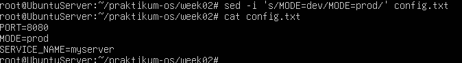


## 4. Ganti semua kemunculan kata (g untuk global), contoh ubah myserver menjadi node:

```bash
sed -i ’s/myserver/node/g’ config . txt
cat config . txt
```

- 


---


# Praktikum 2.11 — Ekstraksi Kolom dengan awk

## **Langkah-langkah**:


## 1. Lihat output:

```bash
df -h
```

- 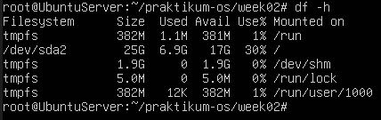


## 2. Ambil kolom filesystem dan persentase pemakaian:

```bash
df -h | awk ’NR ==1 { print $1 , $5 , $6} NR >1 { print $1 ,$5 , $6}’
```

- 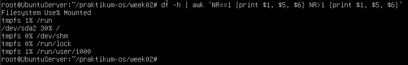


## 3. Filter hanya yang pemakaian disk di atas 80%:

```bash
df -h | awk ’NR==1 || ($5+0) > 80 {print $1 , $5, $6}’
```

- 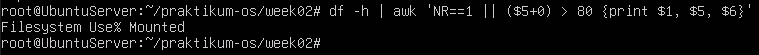


---


# Praktikum 2.12 — Melihat Proses dengan ps

## **Langkah-langkah**:


## 1. Tampilkan semua proses (format BSD):

```bash
ps aux | head
```

- 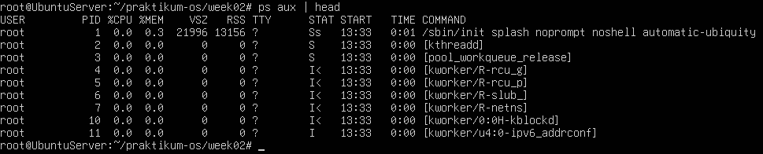


## 2. Cari proses tertentu (misal sshd):

```bash
ps aux | grep -i sshd
```

- 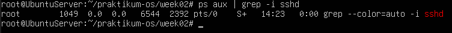


---


# Praktikum 2.13 — Monitoring Real-time dengan top

## **Langkah-langkah**:


## 1. Jalankan top:

```bash
top
```

- 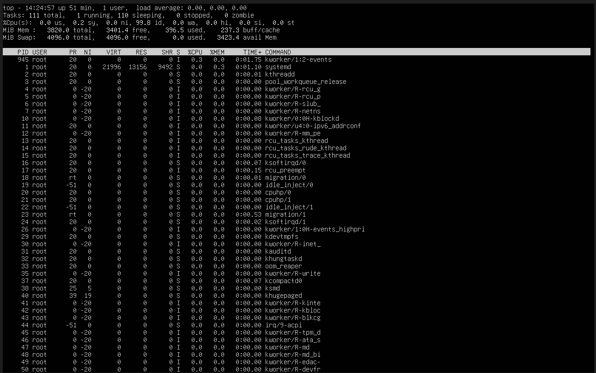


---


# Praktikum 2.14 — Menghentikan Proses dengan kill

## **Langkah-langkah**:


## 1. Jalankan proses dummy di background:

```bash
sleep 300 &
```

- 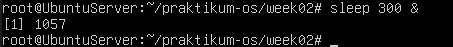


## 2.  Cari PID proses sleep:

```bash
ps aux | grep -E " sleep 300 " | grep -v grep
```

- 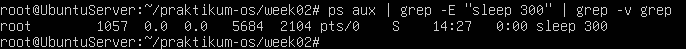


## 3. Hentikan dengan SIGTERM:

```bash
kill <PID_ANDA>
```

- 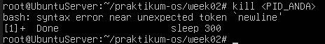


## 4. Verifikasi proses berhenti:

```bash
ps aux | grep -E "sleep 300" | grep -v grep
```

- 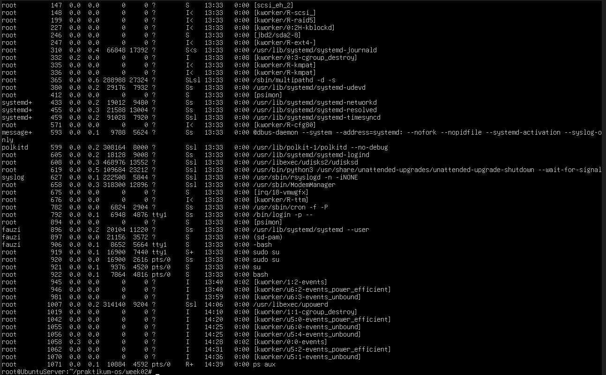


## 5. (Opsional) Jika proses sulit untuk dihentikan dan Anda membutukan untuk menghentikan proses tersebut, gunakan SIGKILL:

```bash
kill -9 <PID_ANDA>
```


---


# Praktikum 2.15 — Cek Disk, Load, dan Service

## **Langkah-langkah**:


## 1. Cek penggunaan disk:

```bash
df -h
```

- 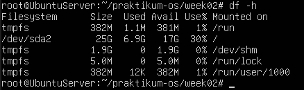


## 2. Cari direktori yang besar (contoh pada /var):

```bash
sudo du - sh / var /* 2 >/ dev / null | sort -h | tail -n 10
```

- 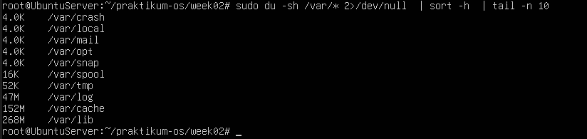


## 3. Cek load dan uptime:

```bash
uptime
```

- 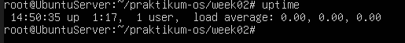


## 4. Cek service yang gagal:

```bash
systemctl --failed
```

- 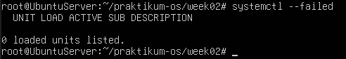


## 5. Cambil log error terbaru (jika ada indikasi masalah):

```bash
journalctl - xe | tail -n 50
```

- 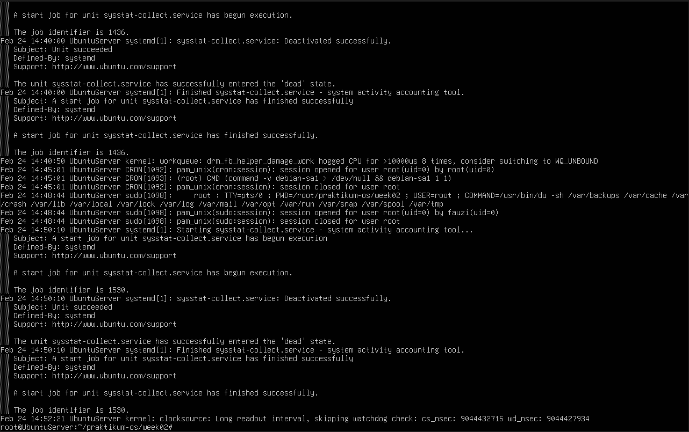


---


# Praktikum 2.16 — Monitoring Port dan Koneksi (Network Basics)
## Tujuan: melihat interface, routing, dan port yang sedang listen (berguna untuk troubleshooting service).


## **Langkah-langkah**:


## 1. Lihat interface dan IP:

```bash
ip a
```

- 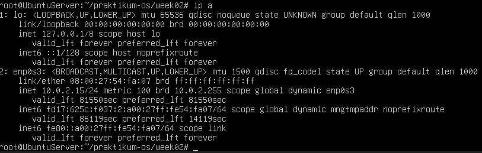


## 2. Lihat routing table:

```bash
ip r
```

- 


## 3. Lihat port yang sedang listening:

```bash
sudo ss -tulpn
```

- 


## Latihan 2.5
### Pilih satu port yang listening dari output ss -tulpn(misal port 22), lalu tuliskan service/proses yang membukanya. Jelaskan kegunaan port tersebut secara singkat.

Port 22 dibuka oleh proses sshd, Port ini digunakan untuk layanan ssh yang memungkinkan akses remote ke server secara aman melalui jaringan


---


# 1.9 Latihan

## Latihan 2.A
### Jalankan lspci -nnk. Pilih 1 perangkat PCI dan tuliskan: nama perangkat, ID vendor:device, dan kernel driver in use.

- 

- Device ID : 8086 (Intel Corporation)
- Vendor ID : 2829 (ICH8M SATA Controller)
- Nama Driver : ahci


---


## Latihan 2.B
### Tentukan device root filesystem dengan findmnt /. Lalu cocokkan dengan lsblk -f dan tuliskan tipe filesystem serta UUID-nya.

- 

- Device root filesystem : /dev/sda2
- FSTYPE : ext4
- UUID : cf5cae60-245a-49d3-85a3-ee3e294484b1


---


## Latihan 2.C
### Buat file server.log berisi minimal 10 baris dengan variasi kata: INFO, WARN, ERROR. Gunakan grep untuk menampilkan hanya baris ERROR.

- 


---


## Latihan 2.D
### Gunakan sed untuk mengganti semua kata server menjadi node pada file latihan. Tunjukkan sebelum dan sesudah

- 


---


## Latihan 2.E
### Gunakan df -h lalu awk untuk menampilkan filesystem yang penggunaan disk di atas 70%.

- 


---


## Latihan 2.F
### Jalankan sleep 600 &. Temukan PID-nya dengan ps. Hentikan dengan SIGTERM. Jelaskan beda SIGTERM vs SIGKILL.


- 


---


## Latihan 2.G
### Gunakan systemctl –failed. Jika tidak ada yang gagal, pilih satu service aktif (misal ssh) dan tampilkan status serta 30 baris log terakhirnya


- 


---