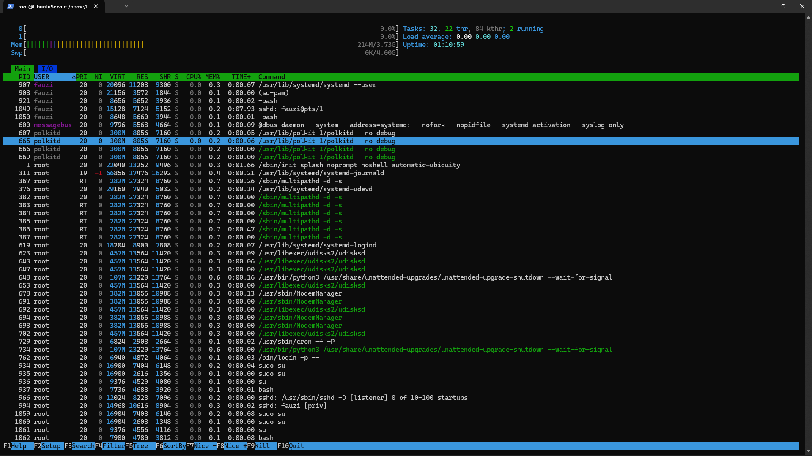

# Praktikum Sistem Operasi – Pertemuan 6  
###  Manajemen Proses

> Nama   : Muhammad Fauzi Fadillah
>
> NIM    : 254107020085
>
> Kelas  : TI_1G


---

# Praktikum 6.1 - Melihat Proses dan Thread 

1. Tampilkan semua proses yang berjalan:

```bash
ps aux
```

Output:  

```bash
root@UbuntuServer:/home/fauzi# ps aux
USER         PID %CPU %MEM    VSZ   RSS TTY      STAT START   TIME COMMAND
root           1  0.2  0.3  22184 13316 ?        Ss   13:27   0:01 /sbin/init splash noprompt noshell automatic-ubiquity
root           2  0.0  0.0      0     0 ?        S    13:27   0:00 [kthreadd]
root           3  0.0  0.0      0     0 ?        S    13:27   0:00 [pool_workqueue_release]
root           4  0.0  0.0      0     0 ?        I<   13:27   0:00 [kworker/R-rcu_g]
root           5  0.0  0.0      0     0 ?        I<   13:27   0:00 [kworker/R-rcu_p]
root           6  0.0  0.0      0     0 ?        I<   13:27   0:00 [kworker/R-slub_]
root           7  0.0  0.0      0     0 ?        I<   13:27   0:00 [kworker/R-netns]
root           8  0.1  0.0      0     0 ?        I    13:27   0:00 [kworker/0:0-cgroup_destroy]
root          11  0.0  0.0      0     0 ?        I    13:27   0:00 [kworker/u4:0-ipv6_addrconf]
root          12  0.0  0.0      0     0 ?        I<   13:27   0:00 [kworker/R-mm_pe]
root          13  0.0  0.0      0     0 ?        I    13:27   0:00 [rcu_tasks_kthread]
root          14  0.0  0.0      0     0 ?        I    13:27   0:00 [rcu_tasks_rude_kthread]
root          15  0.0  0.0      0     0 ?        I    13:27   0:00 [rcu_tasks_trace_kthread]
root          16  0.0  0.0      0     0 ?        S    13:27   0:00 [ksoftirqd/0]
root          17  0.0  0.0      0     0 ?        I    13:27   0:00 [rcu_preempt]
root          18  0.0  0.0      0     0 ?        S    13:27   0:00 [migration/0]
root          19  0.0  0.0      0     0 ?        S    13:27   0:00 [idle_inject/0]
root          20  0.0  0.0      0     0 ?        S    13:27   0:00 [cpuhp/0]
root          21  0.0  0.0      0     0 ?        S    13:27   0:00 [cpuhp/1]
root          22  0.0  0.0      0     0 ?        S    13:27   0:00 [idle_inject/1]
root          23  0.1  0.0      0     0 ?        S    13:27   0:00 [migration/1]
root          24  0.0  0.0      0     0 ?        S    13:27   0:00 [ksoftirqd/1]
root          26  0.0  0.0      0     0 ?        I<   13:27   0:00 [kworker/1:0H-kblockd]
root          29  0.0  0.0      0     0 ?        S    13:27   0:00 [kdevtmpfs]
root          30  0.0  0.0      0     0 ?        I<   13:27   0:00 [kworker/R-inet_]
root          31  0.0  0.0      0     0 ?        S    13:27   0:00 [kauditd]
root          32  0.0  0.0      0     0 ?        S    13:27   0:00 [khungtaskd]
root          33  0.0  0.0      0     0 ?        S    13:27   0:00 [oom_reaper]
root          34  0.0  0.0      0     0 ?        I    13:27   0:00 [kworker/u5:1-events_unbound]
root          36  0.0  0.0      0     0 ?        I<   13:27   0:00 [kworker/R-write]
root          37  0.0  0.0      0     0 ?        S    13:27   0:00 [kcompactd0]
root          38  0.0  0.0      0     0 ?        SN   13:27   0:00 [ksmd]
root          39  0.0  0.0      0     0 ?        SN   13:27   0:00 [khugepaged]
root          40  0.0  0.0      0     0 ?        I<   13:27   0:00 [kworker/R-kinte]
root          41  0.0  0.0      0     0 ?        I<   13:27   0:00 [kworker/R-kbloc]
root          42  0.0  0.0      0     0 ?        I<   13:27   0:00 [kworker/R-blkcg]
root          43  0.0  0.0      0     0 ?        S    13:27   0:00 [irq/9-acpi]
root          44  0.3  0.0      0     0 ?        I    13:27   0:01 [kworker/1:1-events]
root          45  0.0  0.0      0     0 ?        I<   13:27   0:00 [kworker/R-tpm_d]
root          46  0.0  0.0      0     0 ?        I<   13:27   0:00 [kworker/R-ata_s]
root          47  0.0  0.0      0     0 ?        I<   13:27   0:00 [kworker/R-md]
root          48  0.0  0.0      0     0 ?        I<   13:27   0:00 [kworker/R-md_bi]
root          49  0.0  0.0      0     0 ?        I<   13:27   0:00 [kworker/R-edac-]
root          50  0.0  0.0      0     0 ?        I<   13:27   0:00 [kworker/R-devfr]
root          51  0.0  0.0      0     0 ?        S    13:27   0:00 [watchdogd]
root          52  0.0  0.0      0     0 ?        I<   13:27   0:00 [kworker/0:1H-kblockd]
root          53  0.0  0.0      0     0 ?        S    13:27   0:00 [kswapd0]
root          54  0.0  0.0      0     0 ?        S    13:27   0:00 [ecryptfs-kthread]
root          55  0.0  0.0      0     0 ?        I<   13:27   0:00 [kworker/R-kthro]
root          56  0.0  0.0      0     0 ?        I<   13:27   0:00 [kworker/R-acpi_]
root          57  0.0  0.0      0     0 ?        I    13:27   0:00 [kworker/u6:1-events_power_efficient]
root          58  0.0  0.0      0     0 ?        S    13:27   0:00 [scsi_eh_0]
root          59  0.0  0.0      0     0 ?        I<   13:27   0:00 [kworker/R-scsi_]
root          60  0.0  0.0      0     0 ?        S    13:27   0:00 [scsi_eh_1]
root          61  0.0  0.0      0     0 ?        I<   13:27   0:00 [kworker/R-scsi_]
root          62  0.0  0.0      0     0 ?        I    13:27   0:00 [kworker/u6:2-events_unbound]
root          63  0.0  0.0      0     0 ?        I    13:27   0:00 [kworker/u6:3-events_unbound]
root          64  0.0  0.0      0     0 ?        I<   13:27   0:00 [kworker/R-mld]
root          65  0.0  0.0      0     0 ?        I<   13:27   0:00 [kworker/R-ipv6_]
root          66  0.0  0.0      0     0 ?        I    13:27   0:00 [kworker/u4:1-ext4-rsv-conversion]
root          73  0.0  0.0      0     0 ?        I<   13:27   0:00 [kworker/R-kstrp]
root          74  0.0  0.0      0     0 ?        I<   13:27   0:00 [kworker/1:1H-kblockd]
root          75  0.0  0.0      0     0 ?        I    13:27   0:00 [kworker/1:2-cgroup_destroy]
root          77  0.0  0.0      0     0 ?        I<   13:27   0:00 [kworker/u7:0]
root          78  0.0  0.0      0     0 ?        I<   13:27   0:00 [kworker/u8:0]
root          79  0.0  0.0      0     0 ?        I<   13:27   0:00 [kworker/u9:0]
root          84  0.0  0.0      0     0 ?        I<   13:27   0:00 [kworker/R-crypt]
root          94  0.0  0.0      0     0 ?        I<   13:27   0:00 [kworker/R-charg]
root         158  0.0  0.0      0     0 ?        S    13:27   0:00 [scsi_eh_2]
root         160  0.0  0.0      0     0 ?        I<   13:27   0:00 [kworker/R-scsi_]
root         169  0.0  0.0      0     0 ?        I<   13:27   0:00 [kworker/0:2H-kblockd]
root         201  0.0  0.0      0     0 ?        I<   13:28   0:00 [kworker/R-raid5]
root         246  0.0  0.0      0     0 ?        S    13:28   0:00 [jbd2/sda2-8]
root         247  0.0  0.0      0     0 ?        I<   13:28   0:00 [kworker/R-ext4-]
root         312  0.0  0.4  66848 17524 ?        S<s  13:28   0:00 /usr/lib/systemd/systemd-journald
root         351  0.0  0.0      0     0 ?        I<   13:28   0:00 [kworker/R-kmpat]
root         352  0.0  0.0      0     0 ?        I<   13:28   0:00 [kworker/R-kmpat]
root         361  0.1  0.0      0     0 ?        I    13:28   0:00 [kworker/0:3-ata_sff]
root         367  0.0  0.6 288988 27324 ?        SLsl 13:28   0:00 /sbin/multipathd -d -s
root         378  0.0  0.2  29080  7952 ?        Ss   13:28   0:00 /usr/lib/systemd/systemd-udevd
systemd+     421  0.0  0.3  21588 13004 ?        Ss   13:28   0:00 /usr/lib/systemd/systemd-resolved
root         422  0.0  0.0      0     0 ?        S    13:28   0:00 [psimon]
systemd+     431  0.0  0.2  91028  7928 ?        Ssl  13:28   0:00 /usr/lib/systemd/systemd-timesyncd
systemd+     455  0.0  0.2  19012  9468 ?        Ss   13:28   0:00 /usr/lib/systemd/systemd-networkd
root         586  0.0  0.0      0     0 ?        I<   13:28   0:00 [kworker/R-cfg80]
message+     599  0.0  0.1   9792  5548 ?        Ss   13:28   0:00 @dbus-daemon --system --address=systemd: --nofork --n
polkitd      607  0.0  0.2 308164  7984 ?        Ssl  13:28   0:00 /usr/lib/polkit-1/polkitd --no-debug
root         622  0.0  0.2  18132  8868 ?        Ss   13:28   0:00 /usr/lib/systemd/systemd-logind
root         624  0.0  0.3 468972 13532 ?        Ssl  13:28   0:00 /usr/libexec/udisks2/udisksd
syslog       640  0.0  0.1 222508  5952 ?        Ssl  13:28   0:00 /usr/sbin/rsyslogd -n -iNONE
root         663  0.0  0.5 109684 23104 ?        Ssl  13:28   0:00 /usr/bin/python3 /usr/share/unattended-upgrades/unatt
root         676  0.0  0.3 392096 12868 ?        Ssl  13:28   0:00 /usr/sbin/ModemManager
root         711  0.0  0.0      0     0 ?        S    13:28   0:00 [irq/18-vmwgfx]
root         714  0.0  0.0      0     0 ?        I<   13:28   0:00 [kworker/R-ttm]
root         805  0.0  0.0   6824  2908 ?        Ss   13:28   0:00 /usr/sbin/cron -f -P
root         842  0.0  0.0      0     0 ?        I    13:28   0:00 [kworker/u5:4-flush-8:0]
root         844  0.0  0.1   6948  4912 tty1     Ss   13:28   0:00 /bin/login -p --
root         930  0.0  0.0      0     0 ?        S    13:28   0:00 [psimon]
fauzi        932  0.0  0.2  20100 11296 ?        Ss   13:28   0:00 /usr/lib/systemd/systemd --user
fauzi        933  0.0  0.0  21156  3572 ?        S    13:28   0:00 (sd-pam)
fauzi        942  0.0  0.1   8656  5648 tty1     S    13:28   0:00 -bash
root         987  0.0  0.0      0     0 ?        I<   13:28   0:00 [kworker/R-tls-s]
root         989  0.0  0.1  16900  7472 tty1     S+   13:28   0:00 sudo su
root         990  0.0  0.0  16900  2580 pts/0    Ss   13:28   0:00 sudo su
root         991  0.0  0.1   9376  4560 pts/0    S    13:28   0:00 su
root         992  0.0  0.1   7604  4512 pts/0    S+   13:28   0:00 bash
root        1008  0.0  0.2  12024  8252 ?        Ss   13:29   0:00 sshd: /usr/sbin/sshd -D [listener] 0 of 10-100 startu
root        1011  0.0  0.0      0     0 ?        I    13:29   0:00 [kworker/u6:4-events_power_efficient]
root        1012  0.0  0.2  14972 10648 ?        Ss   13:29   0:00 sshd: fauzi [priv]
fauzi       1070  0.0  0.1  15132  7140 ?        S    13:29   0:00 sshd: fauzi@pts/1
fauzi       1071  0.0  0.1   8648  5656 pts/1    Ss   13:29   0:00 -bash
root        1080  0.0  0.1  16900  7420 pts/1    S+   13:29   0:00 sudo su
root        1082  0.0  0.0  16900  2612 pts/2    Ss   13:29   0:00 sudo su
root        1083  0.0  0.1   9376  4524 pts/2    S    13:29   0:00 su
root        1085  0.0  0.1   7604  4484 pts/2    S    13:29   0:00 bash
root        1100  0.0  0.0      0     0 ?        I    13:35   0:00 [kworker/u5:0-events_unbound]
root        1101  0.0  0.1  10884  4600 pts/2    R+   13:35   0:00 ps aux
```

2. Tampilkan proses beserta thread-nya, dapat dilihat pada kolom LWP (LightWeight Process ID):

```bash
ps aux -L
```

Output:  

```bash
root@UbuntuServer:/home/fauzi# ps aux -L
USER         PID     LWP %CPU NLWP %MEM    VSZ   RSS TTY      STAT START   TIME COMMAND
root           1       1  0.1    1  0.3  22184 13316 ?        Ss   13:27   0:01 /sbin/init splash noprompt noshell automatic-ubiquity
root           2       2  0.0    1  0.0      0     0 ?        S    13:27   0:00 [kthreadd]
root           3       3  0.0    1  0.0      0     0 ?        S    13:27   0:00 [pool_workqueue_release]
root           4       4  0.0    1  0.0      0     0 ?        I<   13:27   0:00 [kworker/R-rcu_g]
root           5       5  0.0    1  0.0      0     0 ?        I<   13:27   0:00 [kworker/R-rcu_p]
root           6       6  0.0    1  0.0      0     0 ?        I<   13:27   0:00 [kworker/R-slub_]
root           7       7  0.0    1  0.0      0     0 ?        I<   13:27   0:00 [kworker/R-netns]
root           8       8  0.0    1  0.0      0     0 ?        I    13:27   0:00 [kworker/0:0-cgroup_destroy]
root          11      11  0.0    1  0.0      0     0 ?        I    13:27   0:00 [kworker/u4:0-ipv6_addrconf]
root          12      12  0.0    1  0.0      0     0 ?        I<   13:27   0:00 [kworker/R-mm_pe]
root          13      13  0.0    1  0.0      0     0 ?        I    13:27   0:00 [rcu_tasks_kthread]
root          14      14  0.0    1  0.0      0     0 ?        I    13:27   0:00 [rcu_tasks_rude_kthread]
root          15      15  0.0    1  0.0      0     0 ?        I    13:27   0:00 [rcu_tasks_trace_kthread]
root          16      16  0.0    1  0.0      0     0 ?        S    13:27   0:00 [ksoftirqd/0]
root          17      17  0.0    1  0.0      0     0 ?        I    13:27   0:00 [rcu_preempt]
root          18      18  0.0    1  0.0      0     0 ?        S    13:27   0:00 [migration/0]
root          19      19  0.0    1  0.0      0     0 ?        S    13:27   0:00 [idle_inject/0]
root          20      20  0.0    1  0.0      0     0 ?        S    13:27   0:00 [cpuhp/0]
root          21      21  0.0    1  0.0      0     0 ?        S    13:27   0:00 [cpuhp/1]
root          22      22  0.0    1  0.0      0     0 ?        S    13:27   0:00 [idle_inject/1]
root          23      23  0.0    1  0.0      0     0 ?        S    13:27   0:00 [migration/1]
root          24      24  0.0    1  0.0      0     0 ?        S    13:27   0:00 [ksoftirqd/1]
root          26      26  0.0    1  0.0      0     0 ?        I<   13:27   0:00 [kworker/1:0H-kblockd]
root          29      29  0.0    1  0.0      0     0 ?        S    13:27   0:00 [kdevtmpfs]
root          30      30  0.0    1  0.0      0     0 ?        I<   13:27   0:00 [kworker/R-inet_]
root          31      31  0.0    1  0.0      0     0 ?        S    13:27   0:00 [kauditd]
root          32      32  0.0    1  0.0      0     0 ?        S    13:27   0:00 [khungtaskd]
root          33      33  0.0    1  0.0      0     0 ?        S    13:27   0:00 [oom_reaper]
root          34      34  0.0    1  0.0      0     0 ?        I    13:27   0:00 [kworker/u5:1-events_unbound]
root          36      36  0.0    1  0.0      0     0 ?        I<   13:27   0:00 [kworker/R-write]
root          37      37  0.0    1  0.0      0     0 ?        S    13:27   0:00 [kcompactd0]
root          38      38  0.0    1  0.0      0     0 ?        SN   13:27   0:00 [ksmd]
root          39      39  0.0    1  0.0      0     0 ?        SN   13:27   0:00 [khugepaged]
root          40      40  0.0    1  0.0      0     0 ?        I<   13:27   0:00 [kworker/R-kinte]
root          41      41  0.0    1  0.0      0     0 ?        I<   13:27   0:00 [kworker/R-kbloc]
root          42      42  0.0    1  0.0      0     0 ?        I<   13:27   0:00 [kworker/R-blkcg]
root          43      43  0.0    1  0.0      0     0 ?        S    13:27   0:00 [irq/9-acpi]
root          44      44  0.3    1  0.0      0     0 ?        I    13:27   0:02 [kworker/1:1-events]
root          45      45  0.0    1  0.0      0     0 ?        I<   13:27   0:00 [kworker/R-tpm_d]
root          46      46  0.0    1  0.0      0     0 ?        I<   13:27   0:00 [kworker/R-ata_s]
root          47      47  0.0    1  0.0      0     0 ?        I<   13:27   0:00 [kworker/R-md]
root          48      48  0.0    1  0.0      0     0 ?        I<   13:27   0:00 [kworker/R-md_bi]
root          49      49  0.0    1  0.0      0     0 ?        I<   13:27   0:00 [kworker/R-edac-]
root          50      50  0.0    1  0.0      0     0 ?        I<   13:27   0:00 [kworker/R-devfr]
root          51      51  0.0    1  0.0      0     0 ?        S    13:27   0:00 [watchdogd]
root          52      52  0.0    1  0.0      0     0 ?        I<   13:27   0:00 [kworker/0:1H-kblockd]
root          53      53  0.0    1  0.0      0     0 ?        S    13:27   0:00 [kswapd0]
root          54      54  0.0    1  0.0      0     0 ?        S    13:27   0:00 [ecryptfs-kthread]
root          55      55  0.0    1  0.0      0     0 ?        I<   13:27   0:00 [kworker/R-kthro]
root          56      56  0.0    1  0.0      0     0 ?        I<   13:27   0:00 [kworker/R-acpi_]
root          57      57  0.0    1  0.0      0     0 ?        I    13:27   0:00 [kworker/u6:1-events_power_efficient]
root          58      58  0.0    1  0.0      0     0 ?        S    13:27   0:00 [scsi_eh_0]
root          59      59  0.0    1  0.0      0     0 ?        I<   13:27   0:00 [kworker/R-scsi_]
root          60      60  0.0    1  0.0      0     0 ?        S    13:27   0:00 [scsi_eh_1]
root          61      61  0.0    1  0.0      0     0 ?        I<   13:27   0:00 [kworker/R-scsi_]
root          62      62  0.0    1  0.0      0     0 ?        I    13:27   0:00 [kworker/u6:2-events_unbound]
root          63      63  0.0    1  0.0      0     0 ?        I    13:27   0:00 [kworker/u6:3-events_power_efficient]
root          64      64  0.0    1  0.0      0     0 ?        I<   13:27   0:00 [kworker/R-mld]
root          65      65  0.0    1  0.0      0     0 ?        I<   13:27   0:00 [kworker/R-ipv6_]
root          66      66  0.0    1  0.0      0     0 ?        I    13:27   0:00 [kworker/u4:1-ipv6_addrconf]
root          73      73  0.0    1  0.0      0     0 ?        I<   13:27   0:00 [kworker/R-kstrp]
root          74      74  0.0    1  0.0      0     0 ?        I<   13:27   0:00 [kworker/1:1H-kblockd]
root          75      75  0.0    1  0.0      0     0 ?        I    13:27   0:00 [kworker/1:2-cgroup_destroy]
root          77      77  0.0    1  0.0      0     0 ?        I<   13:27   0:00 [kworker/u7:0]
root          78      78  0.0    1  0.0      0     0 ?        I<   13:27   0:00 [kworker/u8:0]
root          79      79  0.0    1  0.0      0     0 ?        I<   13:27   0:00 [kworker/u9:0]
root          84      84  0.0    1  0.0      0     0 ?        I<   13:27   0:00 [kworker/R-crypt]
root          94      94  0.0    1  0.0      0     0 ?        I<   13:27   0:00 [kworker/R-charg]
root         158     158  0.0    1  0.0      0     0 ?        S    13:27   0:00 [scsi_eh_2]
root         160     160  0.0    1  0.0      0     0 ?        I<   13:27   0:00 [kworker/R-scsi_]
root         169     169  0.0    1  0.0      0     0 ?        I<   13:27   0:00 [kworker/0:2H-kblockd]
root         201     201  0.0    1  0.0      0     0 ?        I<   13:28   0:00 [kworker/R-raid5]
root         246     246  0.0    1  0.0      0     0 ?        S    13:28   0:00 [jbd2/sda2-8]
root         247     247  0.0    1  0.0      0     0 ?        I<   13:28   0:00 [kworker/R-ext4-]
root         312     312  0.0    1  0.4  66848 17524 ?        S<s  13:28   0:00 /usr/lib/systemd/systemd-journald
root         351     351  0.0    1  0.0      0     0 ?        I<   13:28   0:00 [kworker/R-kmpat]
root         352     352  0.0    1  0.0      0     0 ?        I<   13:28   0:00 [kworker/R-kmpat]
root         361     361  0.1    1  0.0      0     0 ?        I    13:28   0:00 [kworker/0:3-ata_sff]
root         367     367  0.0    7  0.6 288988 27324 ?        SLsl 13:28   0:00 /sbin/multipathd -d -s
root         367     380  0.0    7  0.6 288988 27324 ?        SLsl 13:28   0:00 /sbin/multipathd -d -s
root         367     381  0.0    7  0.6 288988 27324 ?        SLsl 13:28   0:00 /sbin/multipathd -d -s
root         367     382  0.0    7  0.6 288988 27324 ?        SLsl 13:28   0:00 /sbin/multipathd -d -s
root         367     383  0.0    7  0.6 288988 27324 ?        SLsl 13:28   0:00 /sbin/multipathd -d -s
root         367     384  0.0    7  0.6 288988 27324 ?        SLsl 13:28   0:00 /sbin/multipathd -d -s
root         367     385  0.0    7  0.6 288988 27324 ?        SLsl 13:28   0:00 /sbin/multipathd -d -s
root         378     378  0.0    1  0.2  29080  7952 ?        Ss   13:28   0:00 /usr/lib/systemd/systemd-udevd
systemd+     421     421  0.0    1  0.3  21588 13004 ?        Ss   13:28   0:00 /usr/lib/systemd/systemd-resolved
root         422     422  0.0    1  0.0      0     0 ?        S    13:28   0:00 [psimon]
systemd+     431     431  0.0    2  0.2  91028  7928 ?        Ssl  13:28   0:00 /usr/lib/systemd/systemd-timesyncd
systemd+     431     472  0.0    2  0.2  91028  7928 ?        Ssl  13:28   0:00 /usr/lib/systemd/systemd-timesyncd
systemd+     455     455  0.0    1  0.2  19012  9468 ?        Ss   13:28   0:00 /usr/lib/systemd/systemd-networkd
root         586     586  0.0    1  0.0      0     0 ?        I<   13:28   0:00 [kworker/R-cfg80]
message+     599     599  0.0    1  0.1   9792  5548 ?        Ss   13:28   0:00 @dbus-daemon --system --address=systemd: --nofork --nopidfile --systemd-activation --syslog-only
polkitd      607     607  0.0    4  0.2 308164  7984 ?        Ssl  13:28   0:00 /usr/lib/polkit-1/polkitd --no-debug
polkitd      607     661  0.0    4  0.2 308164  7984 ?        Ssl  13:28   0:00 /usr/lib/polkit-1/polkitd --no-debug
polkitd      607     662  0.0    4  0.2 308164  7984 ?        Ssl  13:28   0:00 /usr/lib/polkit-1/polkitd --no-debug
polkitd      607     664  0.0    4  0.2 308164  7984 ?        Ssl  13:28   0:00 /usr/lib/polkit-1/polkitd --no-debug
root         622     622  0.0    1  0.2  18132  8868 ?        Ss   13:28   0:00 /usr/lib/systemd/systemd-logind
root         624     624  0.0    6  0.3 468972 13532 ?        Ssl  13:28   0:00 /usr/libexec/udisks2/udisksd
root         624     647  0.0    6  0.3 468972 13532 ?        Ssl  13:28   0:00 /usr/libexec/udisks2/udisksd
root         624     651  0.0    6  0.3 468972 13532 ?        Ssl  13:28   0:00 /usr/libexec/udisks2/udisksd
root         624     654  0.0    6  0.3 468972 13532 ?        Ssl  13:28   0:00 /usr/libexec/udisks2/udisksd
root         624     680  0.0    6  0.3 468972 13532 ?        Ssl  13:28   0:00 /usr/libexec/udisks2/udisksd
root         624     693  0.0    6  0.3 468972 13532 ?        Ssl  13:28   0:00 /usr/libexec/udisks2/udisksd
syslog       640     640  0.0    4  0.1 222508  5952 ?        Ssl  13:28   0:00 /usr/sbin/rsyslogd -n -iNONE
syslog       640     682  0.0    4  0.1 222508  5952 ?        Ssl  13:28   0:00 /usr/sbin/rsyslogd -n -iNONE
syslog       640     683  0.0    4  0.1 222508  5952 ?        Ssl  13:28   0:00 /usr/sbin/rsyslogd -n -iNONE
syslog       640     684  0.0    4  0.1 222508  5952 ?        Ssl  13:28   0:00 /usr/sbin/rsyslogd -n -iNONE
root         663     663  0.0    2  0.5 109684 23104 ?        Ssl  13:28   0:00 /usr/bin/python3 /usr/share/unattended-upgrades/unattended-upgrade-shutdown --wait-for-signal
root         663     784  0.0    2  0.5 109684 23104 ?        Ssl  13:28   0:00 /usr/bin/python3 /usr/share/unattended-upgrades/unattended-upgrade-shutdown --wait-for-signal
root         676     676  0.0    4  0.3 392096 12868 ?        Ssl  13:28   0:00 /usr/sbin/ModemManager
root         676     688  0.0    4  0.3 392096 12868 ?        Ssl  13:28   0:00 /usr/sbin/ModemManager
root         676     691  0.0    4  0.3 392096 12868 ?        Ssl  13:28   0:00 /usr/sbin/ModemManager
root         676     696  0.0    4  0.3 392096 12868 ?        Ssl  13:28   0:00 /usr/sbin/ModemManager
root         711     711  0.0    1  0.0      0     0 ?        S    13:28   0:00 [irq/18-vmwgfx]
root         714     714  0.0    1  0.0      0     0 ?        I<   13:28   0:00 [kworker/R-ttm]
root         805     805  0.0    1  0.0   6824  2908 ?        Ss   13:28   0:00 /usr/sbin/cron -f -P
root         842     842  0.0    1  0.0      0     0 ?        I    13:28   0:00 [kworker/u5:4-flush-8:0]
root         844     844  0.0    1  0.1   6948  4912 tty1     Ss   13:28   0:00 /bin/login -p --
root         930     930  0.0    1  0.0      0     0 ?        S    13:28   0:00 [psimon]
fauzi        932     932  0.0    1  0.2  20100 11296 ?        Ss   13:28   0:00 /usr/lib/systemd/systemd --user
fauzi        933     933  0.0    1  0.0  21156  3572 ?        S    13:28   0:00 (sd-pam)
fauzi        942     942  0.0    1  0.1   8656  5648 tty1     S    13:28   0:00 -bash
root         987     987  0.0    1  0.0      0     0 ?        I<   13:28   0:00 [kworker/R-tls-s]
root         989     989  0.0    1  0.1  16900  7472 tty1     S+   13:28   0:00 sudo su
root         990     990  0.0    1  0.0  16900  2580 pts/0    Ss   13:28   0:00 sudo su
root         991     991  0.0    1  0.1   9376  4560 pts/0    S    13:28   0:00 su
root         992     992  0.0    1  0.1   7604  4512 pts/0    S+   13:28   0:00 bash
root        1008    1008  0.0    1  0.2  12024  8252 ?        Ss   13:29   0:00 sshd: /usr/sbin/sshd -D [listener] 0 of 10-100 startups
root        1011    1011  0.0    1  0.0      0     0 ?        I    13:29   0:00 [kworker/u6:4-events_unbound]
root        1012    1012  0.0    1  0.2  14972 10648 ?        Ss   13:29   0:00 sshd: fauzi [priv]
fauzi       1070    1070  0.0    1  0.1  15132  7140 ?        S    13:29   0:00 sshd: fauzi@pts/1
fauzi       1071    1071  0.0    1  0.1   8648  5656 pts/1    Ss   13:29   0:00 -bash
root        1080    1080  0.0    1  0.1  16900  7428 pts/1    S+   13:29   0:00 sudo su
root        1082    1082  0.0    1  0.0  16900  2612 pts/2    Ss   13:29   0:00 sudo su
root        1083    1083  0.0    1  0.1   9376  4524 pts/2    S    13:29   0:00 su
root        1085    1085  0.0    1  0.1   7604  4484 pts/2    S    13:29   0:00 bash
root        1100    1100  0.0    1  0.0      0     0 ?        I    13:35   0:00 [kworker/u5:0-events_power_efficient]
root        1102    1102  0.0    1  0.1  11012  4636 pts/2    R+   13:37   0:00 ps aux -L
```

3. Lihat PID shell aktif dan detail prosesnya:

```bash
echo $$
ps -p $$ -f
```

Output:  

```bash
root@UbuntuServer:/home/fauzi# echo $$
1085
root@UbuntuServer:/home/fauzi# ps -p $$ -f
UID          PID    PPID  C STIME TTY          TIME CMD
root        1085    1083  0 13:29 pts/2    00:00:00 bash
```

4. Lihat hierarki proses secara visual:

```bash
pstree -p
```

Output:  

```bash
root@UbuntuServer:/home/fauzi# pstree -p
systemd(1)─┬─ModemManager(676)─┬─{ModemManager}(688)
           │                   ├─{ModemManager}(691)
           │                   └─{ModemManager}(696)
           ├─cron(805)
           ├─dbus-daemon(599)
           ├─login(844)───bash(942)───sudo(989)───sudo(990)───su(991)───bash(992)
           ├─multipathd(367)─┬─{multipathd}(380)
           │                 ├─{multipathd}(381)
           │                 ├─{multipathd}(382)
           │                 ├─{multipathd}(383)
           │                 ├─{multipathd}(384)
           │                 └─{multipathd}(385)
           ├─polkitd(607)─┬─{polkitd}(661)
           │              ├─{polkitd}(662)
           │              └─{polkitd}(664)
           ├─rsyslogd(640)─┬─{rsyslogd}(682)
           │               ├─{rsyslogd}(683)
           │               └─{rsyslogd}(684)
           ├─sshd(1008)───sshd(1012)───sshd(1070)───bash(1071)───sudo(1080)───sudo(1082)───su(1083)───bash(1085)───pstree(1107)
           ├─systemd(932)───(sd-pam)(933)
           ├─systemd-journal(312)
           ├─systemd-logind(622)
           ├─systemd-network(455)
           ├─systemd-resolve(421)
           ├─systemd-timesyn(431)───{systemd-timesyn}(472)
           ├─systemd-udevd(378)
           ├─udisksd(624)─┬─{udisksd}(647)
           │              ├─{udisksd}(651)
           │              ├─{udisksd}(654)
           │              ├─{udisksd}(680)
           │              └─{udisksd}(693)
           └─unattended-upgr(663)───{unattended-upgr}(784)
```

## Latihan 6.1

Jalankan ps aux dan amati outputnya:
1. Berapa total proses yang berjalan? Proses apa yang memiliki PID
terkecil?

    >   Jawaban:  
        Ada 120 total proses yang berjalan  
        Proses yang memiliki PID terkecil adalah ```/sbin/init splash noprompt noshell automatic-ubiquity``` dengan PID ```1```

2. Jalankan pstree -p dan temukan proses bash Anda. Proses apa yang
menjadi induk (PPID) dari bash tersebut?

    >   Jawaban:  
        ├─sshd(1008)───sshd(1012)───sshd(1070)───bash(1071)───sudo(1080)───sudo(1082)───su(1083)───bash(1085)───pstree(1125)`  
        induk PPID nya sshd(1008)

3. Bandingkan output ps aux dan ps aux -L. Apa perbedaan yang Anda
lihat?

    >   Jawaban:  
    >   - ```ps aux``` menampilkan 1 baris = 1 proses, contoh root 760 ... /usr/sbin/ModemManager
    >   - ```ps aux -L``` menampilkan thread di dalam proses 1 proses memiliki banyak baris, contoh root 760 760 ...


---

# Praktikum 6.2 - Mengamati Siklus Hidup Proses

1. Buat proses di background dan amati kondisinya:

```bash
sleep 60 &
ps aux | grep sleep
```

Output:  

```bash
root@UbuntuServer:/home/fauzi# sleep 60 &
[1] 1070
root@UbuntuServer:/home/fauzi# ps aux | grep sleep
root        1070  0.0  0.0   5684  2104 pts/2    S    14:31   0:00 sleep 60
root        1072  0.0  0.0   6544  2328 pts/2    S+   14:32   0:00 grep --color=auto sleep
```

2. Amati perubahan exit code dari perintah yang berhasil dan gagal:

```bash
ls / tmp
echo " Sukses : $?"

ls / direktori - tidak - ada
echo " Gagal : $?"
```

Output:  

```bash
root@UbuntuServer:/home/fauzi# echo "Sukses: $?"
Sukses: 0
root@UbuntuServer:/home/fauzi# ls /direktori-tidak-ada
ls: cannot access '/direktori-tidak-ada': No such file or directory
root@UbuntuServer:/home/fauzi# echo "Gagal: $?"
Gagal: 2
```

## Latihan 6.2

1. Jalankan sleep 120 & dan amati kolom STAT pada ps aux. Kondisi apa yang ditampilkan? Mengapa proses sleep berada di kondisi tersebut?

    Output:

    ```bash
    root@UbuntuServer:/home/fauzi# sleep 120 &
    [1] 1082
    root@UbuntuServer:/home/fauzi# ps aux | grep sleep | grep -v grep
    root        1082  0.0  0.0   5684  2104 pts/2    S    14:36   0:00 sleep 120
    ```

    >   Jawaban:  
        muncul S (Sleep) yang tidak melakukan proses aktif dan hanya menunggu waktu yang ditentukan habis

2. Jalankan beberapa perintah yang berhasil dan yang gagal, lalu catat exit code masing-masing. Pola apa yang Anda temukan?

    >   Jawaban:  
        Pola yang ditemukan ketika perintah berhasil maka exit code nya adalah ```0```. Jika perintah tidak berhasil, maka exit code akan tidak sama dengan ```0```


---

# Praktikum 6.3 - Mengatur Prioritas Proses

1. Jalankan proses dengan prioritas rendah:

```bash
nice -n 10 sleep 300 &
```

Output:  

```bash
root@UbuntuServer:/home/fauzi# nice -n 10 sleep 300 &
[2] 1093
[1]   Done                    sleep 120
```

2. Verifikasi nilai nice pada kolom NI:

```bash
ps aux | grep sleep
```

Output:  

```bash
root@UbuntuServer:/home/fauzi# ps aux | grep sleep
root        1093  0.0  0.0   5684  2104 pts/2    SN   14:42   0:00 sleep 300
root        1100  0.0  0.0   6544  2328 pts/2    S+   14:43   0:00 grep --color=auto sleep
```

3. Ubah nilai nice proses yang sudah berjalan:  

```bash
renice -n 15 -p <PID >
ps -p <PID > -o pid , ni , cmd
```

Output:  

```bash
root@UbuntuServer:/home/fauzi# renice -n 15 -p 1093
1093 (process ID) old priority 10, new priority 15
root@UbuntuServer:/home/fauzi# ps -p 1093 -o pid,ni,cmd
    PID  NI CMD
   1093  15 sleep 300
```

4. Bersihkan proses percobaan:  

```bash
kill %1
```


## Latihan 6.3

1. Jalankan nice -n 5 sleep 200 & dan verifikasi nilai NI-nya dengan ps.

    ```bash
    nice -n 5 sleep 200 &
    ps aux | grep sleep | grep -v grep
    ```

    Output:

    ```bash
    root@UbuntuServer:/home/fauzi# nice -n 5 sleep 200 &
    [1] 1110
    root@UbuntuServer:/home/fauzi# ps aux | grep sleep | grep -v grep
    root        1110  0.0  0.0   5684  2100 pts/2    SN   14:48   0:00 sleep 200
    ```

    >   Jawaban:  
        Karena menjalankan command ```-n 5``` maka NI nya adalah ```5```

2. Ubah nilai nice menjadi 10 menggunakan renice, lalu verifikasi kembali.

    ```bash
    renice -n 10 -p <PID>
    ps -p <PID> -o pid,ni,cmd
    ```

    Output:

    ```bash
    root@UbuntuServer:/home/fauzi# renice -n 10 -p 1110
    renice: failed to get priority for 1110 (process ID): No such process
    [1]+  Done                    nice -n 5 sleep 200
    root@UbuntuServer:/home/fauzi# ps -p 1110 -o pid,ni,cmd
    PID  NI CMD
    ```
    >   Jawaban:  
        Nilai NI berubah menjadi ```10```. 

3. Coba ubah nilai nice menjadi -5 tanpa sudo. Apa yang terjadi? Mengapa Linux membatasi hal ini untuk user biasa?

    >   Jawaban:  
        Error karena hanya root yang menjadikan prioritas tertinggi, karena angka semakin kecil


---


# Latihan

1. Cobalah urutan perintah berikut:

```bash
$ cd
$ pwd
```

Output:  

```bash
root@UbuntuServer:/home/fauzi# cd
root@UbuntuServer:~# pwd
```

---

# Praktikum 6.4 - Mengirim Sinyal ke Proses

1. Buat proses percobaan:

```bash
sleep 500 &
sleep 600 &
sleep 700 &
ps aux | grep -v grep | grep sleep
```

Output:  

```bash
root@UbuntuServer:/home/fauzi# sleep 500 &
sleep 600 &
sleep 700 &
ps aux | grep -v grep | grep sleep
[1] 1604
[2] 1605
[3] 1606
root        1604  0.0  0.0   5684  2104 pts/2    S    15:03   0:00 sleep 500
root        1605  0.0  0.0   5684  2104 pts/2    S    15:03   0:00 sleep 600
root        1606  0.0  0.0   5684  2108 pts/2    S    15:03   0:00 sleep 700
```

2. Hentikan satu proses dengan SIGTERM dan verifikasi:

```bash
kill <PID - sleep -500 >
ps aux | grep -v grep | grep sleep
```

Output:  

```bash
root@UbuntuServer:/home/fauzi# kill 1604
root@UbuntuServer:/home/fauzi# ps aux | grep -v grep | grep sleep
root        1605  0.0  0.0   5684  2104 pts/2    S    15:03   0:00 sleep 600
root        1606  0.0  0.0   5684  2108 pts/2    S    15:03   0:00 sleep 700
[1]   Terminated              sleep 500
```

3. Jeda dan lanjutkan proses dengan SIGSTOP/SIGCONT:

```bash
kill -SIGSTOP <PID - sleep -600 >
ps aux | grep sleep 
kill -SIGCONT <PID - sleep -600 >
ps aux | grep sleep

```

Output:  

```bash
root@UbuntuServer:/home/fauzi# kill -SIGSTOP 1605
root@UbuntuServer:/home/fauzi# ps aux | grep sleep
root        1605  0.0  0.0   5684  2104 pts/2    T    15:03   0:00 sleep 600
root        1606  0.0  0.0   5684  2108 pts/2    S    15:03   0:00 sleep 700
root        1619  0.0  0.0   6544  2328 pts/2    S+   15:07   0:00 grep --color=auto sleep

[2]+  Stopped                 sleep 600
root@UbuntuServer:/home/fauzi# kill -SIGCONT 1605
root@UbuntuServer:/home/fauzi# ps aux | grep sleep
root        1605  0.0  0.0   5684  2104 pts/2    S    15:03   0:00 sleep 600
root        1606  0.0  0.0   5684  2108 pts/2    S    15:03   0:00 sleep 700
root        1622  0.0  0.0   6544  2332 pts/2    S+   15:08   0:00 grep --color=auto sleep
```

4. Hentikan semua proses sleep sekaligus:

```bash
pkill sleep
```

## Latihan 6.4

1. Jalankan sleep 400 &, kirim SIGSTOP, dan amati perubahan kolom STAT. Kondisi apa yang muncul?

    >   Jawaban:  
        Kondisi yang muncul adalah ```T``` yaitu Stopped

2. Kirim SIGCONT dan verifikasi proses kembali berjalan.

    >   Jawaban:  
        Kembali berjalan

3. Hentikan proses dengan SIGTERM lalu verifikasi sudah tidak ada. Kapan Anda memilih SIGKILL daripada SIGTERM?

    >   Jawaban:  
        Ketika proses tidak bisa dihentikan, maka SIGTERM gagal. Jadi, urutannya SIGTERM lalu SIGKILL untuk berhenti paksa


---

# Praktikum 6.5 - Manajemen Job Foreground dan Background

1. Jalankan tiga job di background:

```bash
sleep 200 &
sleep 300 &
sleep 400 &
jobs
```

Output:  

```bash
root@UbuntuServer:/home/fauzi# sleep 200 &
sleep 300 &
sleep 400 &
jobs
[2] 1643
[3] 1644
[4] 1645
[1]+  Stopped                 sleep 400
[2]   Running                 sleep 200 &
[3]   Running                 sleep 300 &
[4]-  Running                 sleep 400 &
```

2. Bawa job pertama ke foreground, jeda, lalu kembalikan ke background:

```bash
fg %1
# Tekan Ctrl +Z untuk menjeda
bg %1
jobs
```

Output:  

```bash
root@UbuntuServer:/home/fauzi# fg %1
sleep 400
Terminated
root@UbuntuServer:/home/fauzi# bg %1
bash: bg: %1: no such job
root@UbuntuServer:/home/fauzi# bg %1
jobs
bash: bg: %1: no such job
[2]   Running                 sleep 200 &
[3]-  Running                 sleep 300 &
[4]+  Running                 sleep 400 &
```

3. Hentikan semua job:

```bash
kill %1 %2 %3
jobs
```

Output:  

```bash
root@UbuntuServer:/home/fauzi# kill %1 %2 %3
jobs
bash: kill: %1: no such job
bash: kill: (1643) - No such process
[2]   Done                    sleep 200
[3]-  Running                 sleep 300 &
[4]+  Running                 sleep 400 &
```

## Latihan 6.5

1. Jalankan top di foreground. Apa yang terjadi di terminal?

    >   Jawaban:  
        Terminal terkunci karena menjalankan command di foreground

    ```bash
    root@UbuntuServer:/home/fauzi# top
    top - 15:23:31 up 55 min,  2 users,  load average: 0.00, 0.00, 0.00
    Tasks: 120 total,   1 running, 119 sleeping,   0 stopped,   0 zombie
    %Cpu(s):  0.0 us,  0.0 sy,  0.0 ni,100.0 id,  0.0 wa,  0.0 hi,  0.0 si,  0.0 st
    MiB Mem :   3820.0 total,   2707.1 free,    437.3 used,    899.2 buff/cache
    MiB Swap:   4096.0 total,   4096.0 free,      0.0 used.   3382.7 avail Mem

    PID USER      PR  NI    VIRT    RES    SHR S  %CPU  %MEM     TIME+ COMMAND
    145 root      20   0       0      0      0 I   0.3   0.0   0:10.44 kworker/0:2-events
    1 root      20   0   22040  13252   9496 S   0.0   0.3   0:01.66 systemd
    2 root      20   0       0      0      0 S   0.0   0.0   0:00.02 kthreadd
    3 root      20   0       0      0      0 S   0.0   0.0   0:00.00 pool_workqueue_release
    4 root       0 -20       0      0      0 I   0.0   0.0   0:00.00 kworker/R-rcu_g
    5 root       0 -20       0      0      0 I   0.0   0.0   0:00.00 kworker/R-rcu_p
    6 root       0 -20       0      0      0 I   0.0   0.0   0:00.00 kworker/R-slub_
    7 root       0 -20       0      0      0 I   0.0   0.0   0:00.00 kworker/R-netns
    10 root       0 -20       0      0      0 I   0.0   0.0   0:00.23 kworker/0:0H-kblockd
    11 root      20   0       0      0      0 I   0.0   0.0   0:00.00 kworker/u4:0-ipv6_addrconf
    12 root       0 -20       0      0      0 I   0.0   0.0   0:00.00 kworker/R-mm_pe
    13 root      20   0       0      0      0 I   0.0   0.0   0:00.00 rcu_tasks_kthread
    14 root      20   0       0      0      0 I   0.0   0.0   0:00.00 rcu_tasks_rude_kthread
    15 root      20   0       0      0      0 I   0.0   0.0   0:00.00 rcu_tasks_trace_kthread
    16 root      20   0       0      0      0 S   0.0   0.0   0:00.05 ksoftirqd/0
    17 root      20   0       0      0      0 I   0.0   0.0   0:00.25 rcu_preempt
    18 root      rt   0       0      0      0 S   0.0   0.0   0:00.02 migration/0
    19 root     -51   0       0      0      0 S   0.0   0.0   0:00.00 idle_inject/0
    20 root      20   0       0      0      0 S   0.0   0.0   0:00.00 cpuhp/0
    21 root      20   0       0      0      0 S   0.0   0.0   0:00.00 cpuhp/1
    22 root     -51   0       0      0      0 S   0.0   0.0   0:00.00 idle_inject/1
    23 root      rt   0       0      0      0 S   0.0   0.0   0:00.56 migration/1
    24 root      20   0       0      0      0 S   0.0   0.0   0:00.39 ksoftirqd/1
    26 root       0 -20       0      0      0 I   0.0   0.0   0:00.00 kworker/1:0H-events_highpri
    27 root      20   0       0      0      0 I   0.0   0.0   0:00.25 kworker/u5:0-flush-8:0
    29 root      20   0       0      0      0 S   0.0   0.0   0:00.00 kdevtmpfs
    30 root       0 -20       0      0      0 I   0.0   0.0   0:00.00 kworker/R-inet_
    31 root      20   0       0      0      0 S   0.0   0.0   0:00.00 kauditd
    32 root      20   0       0      0      0 S   0.0   0.0   0:00.00 khungtaskd
    33 root      20   0       0      0      0 S   0.0   0.0   0:00.00 oom_reaper
    34 root      20   0       0      0      0 I   0.0   0.0   0:00.46 kworker/u5:1-flush-8:0
    35 root       0 -20       0      0      0 I   0.0   0.0   0:00.00 kworker/R-write
    37 root      20   0       0      0      0 S   0.0   0.0   0:00.10 kcompactd0
    38 root      25   5       0      0      0 S   0.0   0.0   0:00.00 ksmd
    40 root      39  19       0      0      0 S   0.0   0.0   0:00.00 khugepaged
    41 root       0 -20       0      0      0 I   0.0   0.0   0:00.00 kworker/R-kinte
    42 root       0 -20       0      0      0 I   0.0   0.0   0:00.00 kworker/R-kbloc
    43 root       0 -20       0      0      0 I   0.0   0.0   0:00.00 kworker/R-blkcg
    44 root     -51   0       0      0      0 S   0.0   0.0   0:00.00 irq/9-acpi
    45 root       0 -20       0      0      0 I   0.0   0.0   0:00.00 kworker/R-tpm_d
    46 root       0 -20       0      0      0 I   0.0   0.0   0:00.00 kworker/R-ata_s
    47 root       0 -20       0      0      0 I   0.0   0.0   0:00.00 kworker/R-md
    48 root       0 -20       0      0      0 I   0.0   0.0   0:00.00 kworker/R-md_bi
    49 root       0 -20       0      0      0 I   0.0   0.0   0:00.00 kworker/R-edac-
    50 root       0 -20       0      0      0 I   0.0   0.0   0:00.00 kworker/R-devfr
    51 root     -51   0       0      0      0 S   0.0   0.0   0:00.00 watchdogd
    52 root      20   0       0      0      0 I   0.0   0.0   0:00.61 kworker/u6:1-events_unbound
    ```

2. Tekan Ctrl+Z dan cek statusnya dengan jobs. Kondisi apa yang ditampilkan?

    >   Jawaban:  
        Status stopped

    ```bash
    root@UbuntuServer:/home/fauzi# jobs
    [5]+  Stopped                 top
    ```

3. Pindahkan ke background dengan bg. Apakah top dapat berjalan dengan baik di background? Mengapa?

    >   Jawaban:  
        Tidak berjalan karena butuh interaksi terminal

    ```bash
    root@UbuntuServer:/home/fauzi# bg %1
    [1]+ top &

    [1]+  Stopped                 top
    ```

4. Kembalikan ke foreground dengan fg, lalu keluar dengan q .

    ```bash
    top - 15:31:45 up  1:03,  2 users,  load average: 0.00, 0.00, 0.00
    Tasks: 117 total,   1 running, 116 sleeping,   0 stopped,   0 zombie
    %Cpu(s):  0.0 us,  0.0 sy,  0.0 ni,100.0 id,  0.0 wa,  0.0 hi,  0.0 si,  0.0 st
    MiB Mem :   3820.0 total,   2707.1 free,    437.1 used,    899.3 buff/cache
    MiB Swap:   4096.0 total,   4096.0 free,      0.0 used.   3382.8 avail Mem

    PID USER      PR  NI    VIRT    RES    SHR S  %CPU  %MEM     TIME+ COMMAND
    145 root      20   0       0      0      0 I   0.3   0.0   0:11.98 kworker/0:2-events
    1 root      20   0   22040  13252   9496 S   0.0   0.3   0:01.66 systemd
    2 root      20   0       0      0      0 S   0.0   0.0   0:00.02 kthreadd
    3 root      20   0       0      0      0 S   0.0   0.0   0:00.00 pool_workqueue_release
    4 root       0 -20       0      0      0 I   0.0   0.0   0:00.00 kworker/R-rcu_g
    5 root       0 -20       0      0      0 I   0.0   0.0   0:00.00 kworker/R-rcu_p
    6 root       0 -20       0      0      0 I   0.0   0.0   0:00.00 kworker/R-slub_
    7 root       0 -20       0      0      0 I   0.0   0.0   0:00.00 kworker/R-netns
    10 root       0 -20       0      0      0 I   0.0   0.0   0:00.23 kworker/0:0H-kblockd
    11 root      20   0       0      0      0 I   0.0   0.0   0:00.00 kworker/u4:0-ipv6_addrconf
    12 root       0 -20       0      0      0 I   0.0   0.0   0:00.00 kworker/R-mm_pe
    13 root      20   0       0      0      0 I   0.0   0.0   0:00.00 rcu_tasks_kthread
    14 root      20   0       0      0      0 I   0.0   0.0   0:00.00 rcu_tasks_rude_kthread
    15 root      20   0       0      0      0 I   0.0   0.0   0:00.00 rcu_tasks_trace_kthread
    16 root      20   0       0      0      0 S   0.0   0.0   0:00.05 ksoftirqd/0
    17 root      20   0       0      0      0 I   0.0   0.0   0:00.27 rcu_preempt
    18 root      rt   0       0      0      0 S   0.0   0.0   0:00.02 migration/0
    19 root     -51   0       0      0      0 S   0.0   0.0   0:00.00 idle_inject/0
    20 root      20   0       0      0      0 S   0.0   0.0   0:00.00 cpuhp/0
    21 root      20   0       0      0      0 S   0.0   0.0   0:00.00 cpuhp/1
    22 root     -51   0       0      0      0 S   0.0   0.0   0:00.00 idle_inject/1
    23 root      rt   0       0      0      0 S   0.0   0.0   0:00.57 migration/1
    24 root      20   0       0      0      0 S   0.0   0.0   0:00.39 ksoftirqd/1
    26 root       0 -20       0      0      0 I   0.0   0.0   0:00.00 kworker/1:0H-events_highpri
    27 root      20   0       0      0      0 I   0.0   0.0   0:00.28 kworker/u5:0-events_power_efficient
    29 root      20   0       0      0      0 S   0.0   0.0   0:00.00 kdevtmpfs
    30 root       0 -20       0      0      0 I   0.0   0.0   0:00.00 kworker/R-inet_
    31 root      20   0       0      0      0 S   0.0   0.0   0:00.00 kauditd
    32 root      20   0       0      0      0 S   0.0   0.0   0:00.00 khungtaskd
    33 root      20   0       0      0      0 S   0.0   0.0   0:00.00 oom_reaper
    34 root      20   0       0      0      0 I   0.0   0.0   0:00.46 kworker/u5:1-events_power_efficient
    35 root       0 -20       0      0      0 I   0.0   0.0   0:00.00 kworker/R-write
    37 root      20   0       0      0      0 S   0.0   0.0   0:00.11 kcompactd0
    38 root      25   5       0      0      0 S   0.0   0.0   0:00.00 ksmd
    40 root      39  19       0      0      0 S   0.0   0.0   0:00.00 khugepaged
    41 root       0 -20       0      0      0 I   0.0   0.0   0:00.00 kworker/R-kinte
    42 root       0 -20       0      0      0 I   0.0   0.0   0:00.00 kworker/R-kbloc
    43 root       0 -20       0      0      0 I   0.0   0.0   0:00.00 kworker/R-blkcg
    44 root     -51   0       0      0      0 S   0.0   0.0   0:00.00 irq/9-acpi
    45 root       0 -20       0      0      0 I   0.0   0.0   0:00.00 kworker/R-tpm_d
    46 root       0 -20       0      0      0 I   0.0   0.0   0:00.00 kworker/R-ata_s
    47 root       0 -20       0      0      0 I   0.0   0.0   0:00.00 kworker/R-md
    48 root       0 -20       0      0      0 I   0.0   0.0   0:00.00 kworker/R-md_bi
    49 root       0 -20       0      0      0 I   0.0   0.0   0:00.00 kworker/R-edac-
    50 root       0 -20       0      0      0 I   0.0   0.0   0:00.00 kworker/R-devfr
    51 root     -51   0       0      0      0 S   0.0   0.0   0:00.00 watchdogd
    52 root      20   0       0      0      0 I   0.0   0.0   0:00.63 kworker/u6:1-events_unbound

    root@UbuntuServer:/home/fauzi#
    ```


---

# Praktikum 6.6 - Pemantauan Proses

1. Temukan proses dengan penggunaan CPU dan memori tertinggi:

```bash
ps aux -- sort = -% cpu | head -10
ps aux -- sort = -% mem | head -10
```

Output:  

```bash
root@UbuntuServer:/home/fauzi# ps aux --sort=-%cpu | head -10
ps aux --sort=-%mem | head -10
USER         PID %CPU %MEM    VSZ   RSS TTY      STAT START   TIME COMMAND
root         145  0.3  0.0      0     0 ?        I    14:27   0:12 [kworker/0:2-events]
fauzi       1049  0.1  0.1  15128  7124 ?        S    14:31   0:07 sshd: fauzi@pts/1
root        1118  0.0  0.0      0     0 ?        I    14:50   0:01 [kworker/1:0-cgroup_destroy]
root           1  0.0  0.3  22040 13252 ?        Ss   14:27   0:01 /sbin/init splash noprompt noshell automatic-ubiquity
root        1657  0.0  0.0      0     0 ?        I    15:20   0:00 [kworker/1:2-events]
root        1658  0.0  0.0      0     0 ?        I    15:23   0:00 [kworker/u5:4-events_unbound]
root         367  0.0  0.6 288988 27324 ?        SLsl 14:27   0:00 /sbin/multipathd -d -s
root          52  0.0  0.0      0     0 ?        I    14:27   0:00 [kworker/u6:1-events_unbound]
root          23  0.0  0.0      0     0 ?        S    14:27   0:00 [migration/1]
USER         PID %CPU %MEM    VSZ   RSS TTY      STAT START   TIME COMMAND
root         367  0.0  0.6 288988 27324 ?        SLsl 14:27   0:00 /sbin/multipathd -d -s
root         648  0.0  0.5 109684 23220 ?        Ssl  14:27   0:00 /usr/bin/python3 /usr/share/unattended-upgrades/unattended-upgrade-shutdown --wait-for-signal
root         311  0.0  0.4  66856 17476 ?        S<s  14:27   0:00 /usr/lib/systemd/systemd-journald
root         623  0.0  0.3 468976 13564 ?        Ssl  14:27   0:00 /usr/libexec/udisks2/udisksd
root           1  0.0  0.3  22040 13252 ?        Ss   14:27   0:01 /sbin/init splash noprompt noshell automatic-ubiquity
root         678  0.0  0.3 392100 13056 ?        Ssl  14:27   0:00 /usr/sbin/ModemManager
systemd+     447  0.0  0.3  21584 13028 ?        Ss   14:27   0:00 /usr/lib/systemd/systemd-resolved
fauzi        907  0.0  0.2  20096 11208 ?        Ss   14:28   0:00 /usr/lib/systemd/systemd --user
root         994  0.0  0.2  14968 10616 ?        Ss   14:31   0:00 sshd: fauzi [priv]
```

2. Jalankan top dan eksplorasi shortcut-nya:

```bash
top
# Tekan M, P, 1 , u secara bergantian
# Tekan q untuk keluar
```

Output:  

```bash
top - 15:36:31 up  1:08,  2 users,  load average: 0.00, 0.00, 0.00
Tasks: 116 total,   1 running, 115 sleeping,   0 stopped,   0 zombie
%Cpu(s):  0.0 us,  0.2 sy,  0.0 ni, 99.8 id,  0.0 wa,  0.0 hi,  0.0 si,  0.0 st
MiB Mem :   3820.0 total,   2707.1 free,    437.1 used,    899.4 buff/cache
MiB Swap:   4096.0 total,   4096.0 free,      0.0 used.   3382.9 avail Mem

    PID USER      PR  NI    VIRT    RES    SHR S  %CPU  %MEM     TIME+ COMMAND
    367 root      rt   0  288988  27324   8760 S   0.0   0.7   0:00.73 multipathd
    648 root      20   0  109684  23220  13764 S   0.0   0.6   0:00.16 unattended-upgr
    311 root      19  -1   66856  17476  16292 S   0.0   0.4   0:00.26 systemd-journal
    623 root      20   0  468976  13564  11420 S   0.0   0.3   0:00.17 udisksd
      1 root      20   0   22040  13252   9496 S   0.0   0.3   0:01.66 systemd
    678 root      20   0  392100  13056  10988 S   0.0   0.3   0:00.14 ModemManager
    447 systemd+  20   0   21584  13028  10696 S   0.0   0.3   0:00.12 systemd-resolve
    907 fauzi     20   0   20096  11208   9300 S   0.0   0.3   0:00.07 systemd
    994 root      20   0   14968  10616   8904 S   0.0   0.3   0:00.01 sshd
    435 systemd+  20   0   19012   9588   8420 S   0.0   0.2   0:00.09 systemd-network
    619 root      20   0   18204   8900   7808 S   0.0   0.2   0:00.07 systemd-logind
    966 root      20   0   12024   8228   7096 S   0.0   0.2   0:00.00 sshd
    607 polkitd   20   0  308164   8056   7160 S   0.0   0.2   0:00.13 polkitd
    450 systemd+  20   0   91028   7956   6984 S   0.0   0.2   0:00.06 systemd-timesyn
    376 root      20   0   29160   7940   5032 S   0.0   0.2   0:00.14 systemd-udevd
   1059 root      20   0   16904   7408   6140 S   0.0   0.2   0:00.08 sudo
    934 root      20   0   16900   7404   6148 S   0.0   0.2   0:00.04 sudo
   1049 fauzi     20   0   15128   7124   5152 S   0.7   0.2   0:07.25 sshd
    662 syslog    20   0  222508   6032   4544 S   0.0   0.2   0:00.07 rsyslogd
   1684 root      20   0   11960   6008   3756 R   0.0   0.2   0:00.02 top
   1050 fauzi     20   0    8648   5660   3944 S   0.0   0.1   0:00.01 bash
    921 fauzi     20   0    8656   5652   3936 S   0.0   0.1   0:00.02 bash
    600 message+  20   0    9796   5568   4664 S   0.0   0.1   0:00.09 dbus-daemon
    762 root      20   0    6940   4872   4064 S   0.0   0.1   0:00.03 login
   1062 root      20   0    7980   4780   3812 S   0.0   0.1   0:00.08 bash
    937 root      20   0    7736   4688   3920 S   0.0   0.1   0:00.01 bash
   1061 root      20   0    9376   4556   4116 S   0.0   0.1   0:00.00 su
    936 root      20   0    9376   4520   4080 S   0.0   0.1   0:00.00 su
    908 fauzi     20   0   21156   3572   1844 S   0.0   0.1   0:00.00 (sd-pam)
    729 root      20   0    6824   2908   2664 S   0.0   0.1   0:00.02 cron
    935 root      20   0   16900   2616   1356 S   0.0   0.1   0:00.00 sudo
   1060 root      20   0   16904   2608   1348 S   0.0   0.1   0:00.00 sudo
      2 root      20   0       0      0      0 S   0.0   0.0   0:00.02 kthreadd
      3 root      20   0       0      0      0 S   0.0   0.0   0:00.00 pool_workqueue_release
      4 root       0 -20       0      0      0 I   0.0   0.0   0:00.00 kworker/R-rcu_g
      5 root       0 -20       0      0      0 I   0.0   0.0   0:00.00 kworker/R-rcu_p
      6 root       0 -20       0      0      0 I   0.0   0.0   0:00.00 kworker/R-slub_
      7 root       0 -20       0      0      0 I   0.0   0.0   0:00.00 kworker/R-netns
     10 root       0 -20       0      0      0 I   0.0   0.0   0:00.24 kworker/0:0H-kblockd
     11 root      20   0       0      0      0 I   0.0   0.0   0:00.00 kworker/u4:0-ipv6_addrconf
     12 root       0 -20       0      0      0 I   0.0   0.0   0:00.00 kworker/R-mm_pe
     13 root      20   0       0      0      0 I   0.0   0.0   0:00.00 rcu_tasks_kthread
     14 root      20   0       0      0      0 I   0.0   0.0   0:00.00 rcu_tasks_rude_kthread
     15 root      20   0       0      0      0 I   0.0   0.0   0:00.00 rcu_tasks_trace_kthread
     16 root      20   0       0      0      0 S   0.0   0.0   0:00.05 ksoftirqd/0
     17 root      20   0       0      0      0 I   0.0   0.0   0:00.28 rcu_preempt
     18 root      rt   0       0      0      0 S   0.0   0.0   0:00.02 migration/0
```

3. Instal dan jalankan htop:

```bash
sudo apt install -y htop
htop
# Tekan F6 untuk pilih kolom pengurutan
# Tekan F10 atau q untuk keluar
```

Output:  

- 


## Latihan 6.6

1. Gunakan ps aux –sort=%mem untuk menemukan proses yang menggunakan memori paling banyak di VM Anda. Proses apa itu?

    >   Jawaban:  
        Proses yang menggunakan memori paling banyak ada di baris pertama yaitu  
        ```root        1696  0.1  1.0 478180 41760 ?        Ssl  15:40   0:00 /usr/libexec/fwupd/fwupd```

    ```bash
    ps aux --sort=-%mem | head
    ```

    Output:  
    ```bash
    root@UbuntuServer:/home/fauzi# ps aux --sort=-%mem | head
    USER         PID %CPU %MEM    VSZ   RSS TTY      STAT START   TIME COMMAND
    root        1696  0.1  1.0 478180 41760 ?        Ssl  15:40   0:00 /usr/libexec/fwupd/fwupd
    root         367  0.0  0.6 288988 27324 ?        SLsl 14:27   0:00 /sbin/multipathd -d -s
    root         648  0.0  0.5 109684 23220 ?        Ssl  14:27   0:00 /usr/bin/python3 /usr/share/unattended-upgrades/unattended-upgrade-shutdown --wait-for-signal
    root         311  0.0  0.4  66856 17492 ?        S<s  14:27   0:00 /usr/lib/systemd/systemd-journald
    root         623  0.0  0.3 468976 13580 ?        Ssl  14:27   0:00 /usr/libexec/udisks2/udisksd
    root           1  0.0  0.3  22040 13252 ?        Ss   14:27   0:01 /sbin/init splash noprompt noshell automatic-ubiquity
    root         678  0.0  0.3 392100 13056 ?        Ssl  14:27   0:00 /usr/sbin/ModemManager
    systemd+     447  0.0  0.3  21584 13028 ?        Ss   14:27   0:00 /usr/lib/systemd/systemd-resolved
    fauzi        907  0.0  0.2  20096 11208 ?        Ss   14:28   0:00 /usr/lib/systemd/systemd --user
    ```

2. Di dalam top, tekan 1 . Apa yang berubah pada tampilan? Mengapa informasi ini berguna?

    >   Jawaban:  
        CPU ditampilkan per core, berguna untuk cek core mana yang sibuk

    Output:
    ```bash
    root@UbuntuServer:/home/fauzi# top
    top - 15:45:07 up  1:17,  2 users,  load average: 0.00, 0.00, 0.00
    Tasks: 120 total,   2 running, 118 sleeping,   0 stopped,   0 zombie
    %Cpu0  :  0.0 us,  0.0 sy,  0.0 ni,100.0 id,  0.0 wa,  0.0 hi,  0.0 si,  0.0 st
    %Cpu1  :  0.0 us,  0.0 sy,  0.0 ni,100.0 id,  0.0 wa,  0.0 hi,  0.0 si,  0.0 st
    MiB Mem :   3820.0 total,   2704.9 free,    415.8 used,    923.4 buff/cache
    MiB Swap:   4096.0 total,   4096.0 free,      0.0 used.   3404.2 avail Mem

        PID USER      PR  NI    VIRT    RES    SHR S  %CPU  %MEM     TIME+ COMMAND
        1652 root      20   0       0      0      0 I   0.3   0.0   0:00.91 kworker/0:1-events
        1 root      20   0   22040  13252   9496 S   0.0   0.3   0:01.68 systemd
        2 root      20   0       0      0      0 S   0.0   0.0   0:00.02 kthreadd
        3 root      20   0       0      0      0 S   0.0   0.0   0:00.00 pool_workqueue_release
        4 root       0 -20       0      0      0 I   0.0   0.0   0:00.00 kworker/R-rcu_g
        5 root       0 -20       0      0      0 I   0.0   0.0   0:00.00 kworker/R-rcu_p
        6 root       0 -20       0      0      0 I   0.0   0.0   0:00.00 kworker/R-slub_
        7 root       0 -20       0      0      0 I   0.0   0.0   0:00.00 kworker/R-netns
        10 root       0 -20       0      0      0 I   0.0   0.0   0:00.25 kworker/0:0H-kblockd
        11 root      20   0       0      0      0 I   0.0   0.0   0:00.00 kworker/u4:0-ipv6_addrconf
        12 root       0 -20       0      0      0 I   0.0   0.0   0:00.00 kworker/R-mm_pe
        13 root      20   0       0      0      0 I   0.0   0.0   0:00.00 rcu_tasks_kthread
        14 root      20   0       0      0      0 I   0.0   0.0   0:00.00 rcu_tasks_rude_kthread
        15 root      20   0       0      0      0 I   0.0   0.0   0:00.00 rcu_tasks_trace_kthread
        16 root      20   0       0      0      0 S   0.0   0.0   0:00.06 ksoftirqd/0
        17 root      20   0       0      0      0 I   0.0   0.0   0:00.31 rcu_preempt
        18 root      rt   0       0      0      0 S   0.0   0.0   0:00.02 migration/0
        19 root     -51   0       0      0      0 S   0.0   0.0   0:00.00 idle_inject/0
        20 root      20   0       0      0      0 S   0.0   0.0   0:00.00 cpuhp/0
        21 root      20   0       0      0      0 S   0.0   0.0   0:00.00 cpuhp/1
        22 root     -51   0       0      0      0 S   0.0   0.0   0:00.00 idle_inject/1
        23 root      rt   0       0      0      0 S   0.0   0.0   0:00.58 migration/1
        24 root      20   0       0      0      0 S   0.0   0.0   0:00.39 ksoftirqd/1
        26 root       0 -20       0      0      0 I   0.0   0.0   0:00.00 kworker/1:0H-events_highpri
        29 root      20   0       0      0      0 S   0.0   0.0   0:00.00 kdevtmpfs
        30 root       0 -20       0      0      0 I   0.0   0.0   0:00.00 kworker/R-inet_
        31 root      20   0       0      0      0 S   0.0   0.0   0:00.00 kauditd
        32 root      20   0       0      0      0 S   0.0   0.0   0:00.00 khungtaskd
        33 root      20   0       0      0      0 S   0.0   0.0   0:00.00 oom_reaper
        34 root      20   0       0      0      0 R   0.0   0.0   0:00.56 kworker/u5:1-events_power_efficient
        35 root       0 -20       0      0      0 I   0.0   0.0   0:00.00 kworker/R-write
        37 root      20   0       0      0      0 S   0.0   0.0   0:00.13 kcompactd0
        38 root      25   5       0      0      0 S   0.0   0.0   0:00.00 ksmd
        40 root      39  19       0      0      0 S   0.0   0.0   0:00.00 khugepaged
        41 root       0 -20       0      0      0 I   0.0   0.0   0:00.00 kworker/R-kinte
        42 root       0 -20       0      0      0 I   0.0   0.0   0:00.00 kworker/R-kbloc
        43 root       0 -20       0      0      0 I   0.0   0.0   0:00.00 kworker/R-blkcg
        44 root     -51   0       0      0      0 S   0.0   0.0   0:00.00 irq/9-acpi
        45 root       0 -20       0      0      0 I   0.0   0.0   0:00.00 kworker/R-tpm_d
        46 root       0 -20       0      0      0 I   0.0   0.0   0:00.00 kworker/R-ata_s
        47 root       0 -20       0      0      0 I   0.0   0.0   0:00.00 kworker/R-md
        48 root       0 -20       0      0      0 I   0.0   0.0   0:00.00 kworker/R-md_bi
        49 root       0 -20       0      0      0 I   0.0   0.0   0:00.00 kworker/R-edac-
        50 root       0 -20       0      0      0 I   0.0   0.0   0:00.00 kworker/R-devfr
        51 root     -51   0       0      0      0 S   0.0   0.0   0:00.00 watchdogd
        52 root      20   0       0      0      0 I   0.0   0.0   0:00.65 kworker/u6:1-events_unbound
    ```

3. Di dalam htop, navigasikan ke proses sshd menggunakan tombol panah. Tekan F9 dan amati opsi sinyal yang tersedia

    >   Jawaban:  
        Muncul pilihan sinyal SIGTERM, SIGKILL, SIGSTOP, dll


---

# Latihan 6.A - Eksplorasi proses sistem

1. Jalankan ps aux –forest dan temukan proses dengan PID 1. Apa nama dan fungsi proses tersebut dalam sistem Linux modern?

```bash
ps aux --forest
```

Jawaban:  
Nama fungsi ```root           1  0.0  0.3  22040 13252 ?        Ss   14:27   0:01 /sbin/init splash noprompt noshell automatic-ubiquity```
Proses pertama saat Linux boot
Tugasnya:
Menjalankan service
Mengatur sistem

2. Hitung berapa proses yang dimiliki oleh user root dan berapa yang dimiliki oleh user Anda. Mengapa root memiliki lebih banyak proses?

```bash
ps aux | awk '{print $1}' | sort | uniq -c
```

Output:  

```bash
root@UbuntuServer:/home/fauzi# ps aux | awk '{print $1}' | sort | uniq -c
      5 fauzi
      1 message+
      1 polkitd
    109 root
      1 syslog
      3 systemd+
      1 USER
```

Jawaban:  
root memiliki 109 proses dan user fauzi memiliki 5 proses. Root bisa lebih banyak prosesnya karena menjalankan service sistem, sedangkan user fauzi hanya menjalankan aplikasi sendiri


3. Temukan semua proses yang berada dalam kondisi S. Mengapa sebagian besar proses di sistem berada dalam kondisi ini?

```bash
ps aux | grep " S "
```

Output:  

```bash
root@UbuntuServer:/home/fauzi# ps aux | grep " S "
root           2  0.0  0.0      0     0 ?        S    14:27   0:00 [kthreadd]
root           3  0.0  0.0      0     0 ?        S    14:27   0:00 [pool_workqueue_release]
root          16  0.0  0.0      0     0 ?        S    14:27   0:00 [ksoftirqd/0]
root          18  0.0  0.0      0     0 ?        S    14:27   0:00 [migration/0]
root          19  0.0  0.0      0     0 ?        S    14:27   0:00 [idle_inject/0]
root          20  0.0  0.0      0     0 ?        S    14:27   0:00 [cpuhp/0]
root          21  0.0  0.0      0     0 ?        S    14:27   0:00 [cpuhp/1]
root          22  0.0  0.0      0     0 ?        S    14:27   0:00 [idle_inject/1]
root          23  0.0  0.0      0     0 ?        S    14:27   0:00 [migration/1]
root          24  0.0  0.0      0     0 ?        S    14:27   0:00 [ksoftirqd/1]
root          29  0.0  0.0      0     0 ?        S    14:27   0:00 [kdevtmpfs]
root          31  0.0  0.0      0     0 ?        S    14:27   0:00 [kauditd]
root          32  0.0  0.0      0     0 ?        S    14:27   0:00 [khungtaskd]
root          33  0.0  0.0      0     0 ?        S    14:27   0:00 [oom_reaper]
root          37  0.0  0.0      0     0 ?        S    14:27   0:00 [kcompactd0]
root          44  0.0  0.0      0     0 ?        S    14:27   0:00 [irq/9-acpi]
root          51  0.0  0.0      0     0 ?        S    14:27   0:00 [watchdogd]
root          54  0.0  0.0      0     0 ?        S    14:27   0:00 [kswapd0]
root          55  0.0  0.0      0     0 ?        S    14:27   0:00 [ecryptfs-kthread]
root          59  0.0  0.0      0     0 ?        S    14:27   0:00 [scsi_eh_0]
root          61  0.0  0.0      0     0 ?        S    14:27   0:00 [scsi_eh_1]
root         146  0.0  0.0      0     0 ?        S    14:27   0:00 [scsi_eh_2]
root         245  0.0  0.0      0     0 ?        S    14:27   0:00 [jbd2/sda2-8]
root         393  0.0  0.0      0     0 ?        S    14:27   0:00 [psimon]
root         649  0.0  0.0      0     0 ?        S    14:27   0:00 [irq/18-vmwgfx]
root         905  0.0  0.0      0     0 ?        S    14:28   0:00 [psimon]
fauzi        908  0.0  0.0  21156  3572 ?        S    14:28   0:00 (sd-pam)
fauzi        921  0.0  0.1   8656  5652 tty1     S    14:28   0:00 -bash
root         936  0.0  0.1   9376  4520 pts/0    S    14:28   0:00 su
fauzi       1049  0.1  0.1  15128  7124 ?        S    14:31   0:08 sshd: fauzi@pts/1
root        1061  0.0  0.1   9376  4556 pts/2    S    14:31   0:00 su
root        1062  0.0  0.1   7980  4784 pts/2    S    14:31   0:00 bash
root        1745  0.0  0.0   6544  2328 pts/2    S+   15:55   0:00 grep --color=auto  S
```

Jawaban:  
Sebagian proses berstatus S (sleeping) karena proses menunggu event/input dan tidak selalu memakai CPU


# Latihan 6.B - Simulasi Manajemen Job

1. Jalankan tiga perintah sleep dengan durasi 100, 200, dan 300 detik di background. Verifikasi ketiganya dengan jobs

```bash
sleep 100 &
sleep 200 &
sleep 300 &
jobs
```

Output
```bash
root@UbuntuServer:/home/fauzi# sleep 100 &
sleep 200 &
sleep 300 &
jobs
[1] 1748
[2] 1749
[3] 1750
[1]   Running                 sleep 100 &
[2]-  Running                 sleep 200 &
[3]+  Running                 sleep 300 &
```

2. Bawa job kedua ke foreground, jeda dengan Ctrl+Z , lalu kembalikan ke background dengan bg.

```bash
fg %2
# ctrl+z
bg %2
```

Output:
```bash
root@UbuntuServer:/home/fauzi# fg %2
sleep 200
^Z
[2]+  Stopped                 sleep 200
root@UbuntuServer:/home/fauzi# bg %2
[2]+ sleep 200 &
root@UbuntuServer:/home/fauzi#
```

3. Hentikan job pertama dengan kill %1. Tampilkan kembali daftar job. Berapa job yang tersisa?

```bash
kill %1
jobs
```

Output:
```bash
root@UbuntuServer:/home/fauzi# kill %1
jobs
bash: kill: (1748) - No such process
[1]   Done                    sleep 100
[2]-  Running                 sleep 200 &
[3]+  Running                 sleep 300 &
```


# Latihan 6.C - Prioritas dan Sinyal

1. Jalankan dua proses sleep: satu dengan nice +5 dan satu dengan nice +15. Verifikasi nilai NI keduanya dengan ps.

```bash
nice -n 5 sleep 300 &
nice -n 15 sleep 300 &
ps aux | grep sleep | grep -v grep
```

Output:
```bash
root@UbuntuServer:/home/fauzi# nice -n 5 sleep 300 &
nice -n 15 sleep 300 &
ps aux | grep sleep | grep -v grep
[1] 1757
[2] 1758
root        1757  0.0  0.0   5684  2104 pts/2    SN   16:03   0:00 sleep 300
root        1758  0.0  0.0   5684  2100 pts/2    SN   16:03   0:00 sleep 300
```

2. Gunakan renice untuk mengubah nice proses pertama menjadi +10. Proses mana yang kini lebih diprioritaskan scheduler?

```bash
renice -n 10 -p <PID pertama>
```

Output:
```bash
root@UbuntuServer:/home/fauzi# renice -n 10 -p 1757
1757 (process ID) old priority 5, new priority 10
```

>   Jawaban:  
    Proses NI yang lebih kecil akan diprioritaskan, jadi NI 10 lebih dulu


3. Kirim SIGSTOP ke salah satu proses, verifikasi kondisi T-nya, lalu kirim SIGCONT. Akhiri semua proses percobaan dengan pkill sleep.

```bash
kill -SIGSTOP <PID>
```

```bash
ps aux | grep sleep
```

```bash
kill -SIGCONT <PID>
```

```bash
pkill sleep
```

Output:
```bash
root@UbuntuServer:/home/fauzi# kill -SIGSTOP 1757
root@UbuntuServer:/home/fauzi# ps aux | grep sleep
root        1757  0.0  0.0   5684  2104 pts/2    TN   16:03   0:00 sleep 300
root        1758  0.0  0.0   5684  2100 pts/2    SN   16:03   0:00 sleep 300
root        1783  0.0  0.0   6544  2328 pts/2    S+   16:07   0:00 grep --color=auto sleep

[1]+  Stopped                 nice -n 5 sleep 300
root@UbuntuServer:/home/fauzi# kill -SIGCONT 1757
root@UbuntuServer:/home/fauzi# ps aux | grep sleep
root        1757  0.0  0.0   5684  2104 pts/2    SN   16:03   0:00 sleep 300
root        1758  0.0  0.0   5684  2100 pts/2    SN   16:03   0:00 sleep 300
root        1787  0.0  0.0   6544  2328 pts/2    S+   16:08   0:00 grep --color=auto sleep
root@UbuntuServer:/home/fauzi# pkill sleep
[1]-  Terminated              nice -n 5 sleep 300
[2]+  Terminated              nice -n 15 sleep 300
```


